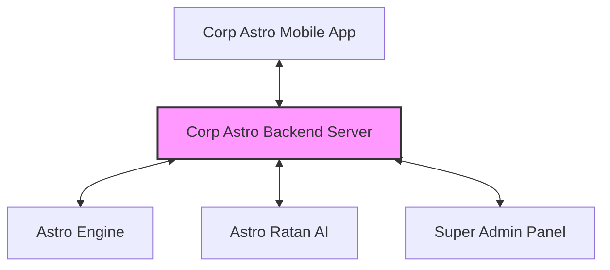
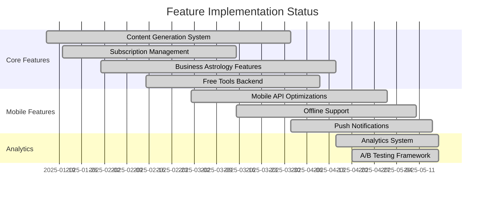
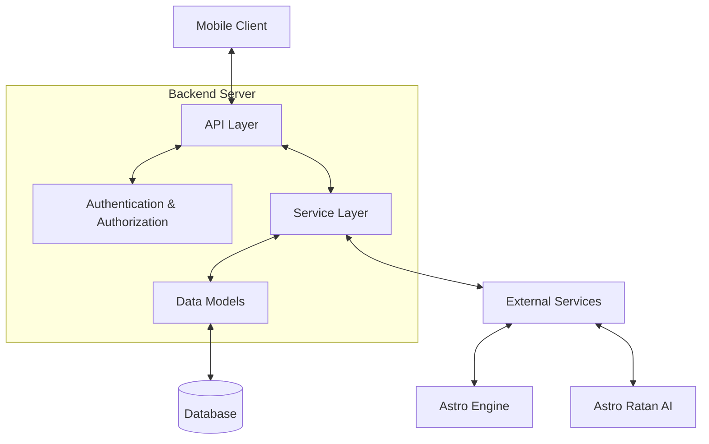

# Corp Astro Backend Server

<div align="center">


**A comprehensive backend server for corporate astrology services**

[](https://www.typescriptlang.org/)
[](https://nodejs.org/)
[](https://expressjs.com/)
[](https://www.postgresql.org/)
[](https://sequelize.org/)

</div>

## 📋 Overview

The Corp Astro Backend Server provides the foundation for the Corp Astro mobile application, delivering corporate astrology services, personalized content, and business astrological insights. This server is built with TypeScript and follows modern backend development practices to ensure scalability, maintainability, and performance.

### 🌟 What is Corp Astro?

Corp Astro is a comprehensive astrology platform focused on corporate and business astrology. It helps business owners and entrepreneurs make informed decisions based on astrological insights tailored specifically for business contexts. The platform offers various features across different subscription tiers, from free basic tools to premium personalized consultations.

### 🧩 Project Components



1. **Corp Astro Mobile Application**: The primary client interface for users to access corporate astrology services
2. **Corp Astro Backend Server** (this repository): Provides APIs, content generation, and business logic
3. **Super Admin Panel (SAP)**: Web-based administration interface for content management and analytics (developed separately)
4. **Astro Ratan**: AI agent built using OpenAI Assistant APIs, trained on astrology texts for personalized guidance
5. **Astro Engine**: Core calculation component generating charts and predictions using Swiss Ephemeris with sidereal zodiac system, whole sign system, and lahiri ayanamsa

### 🚀 Key Features

<table>
  <tr>
    <td width="50%">
      <h4>🔮 Content Generation System</h4>
      <ul>
        <li>Daily horoscopes tailored for business contexts</li>
        <li>Monthly business forecast reports</li>
        <li>Personalized content based on user's birth chart</li>
        <li>Content delivery based on subscription tier</li>
      </ul>
    </td>
    <td width="50%">
      <h4>💰 Subscription Tier Management</h4>
      <ul>
        <li><b>Free Tier:</b> Basic tools and limited content</li>
        <li><b>Basic Tier:</b> Daily horoscopes, monthly reports, Astro Ratan chat</li>
        <li><b>Premium Tier:</b> All features plus business forecasts and human consultations</li>
        <li>Seamless subscription handling with secure payment processing</li>
      </ul>
    </td>
  </tr>
  <tr>
    <td>
      <h4>💼 Business Astrology Features</h4>
      <ul>
        <li>Business natal charts based on founding date/time</li>
        <li>Strategic timing recommendations for business decisions</li>
        <li>Team compatibility analysis</li>
        <li>Detailed business profile management</li>
      </ul>
    </td>
    <td>
      <h4>🔧 Free Tools</h4>
      <ul>
        <li>Business name numerology analysis using Chaldean system</li>
        <li>Tagline compatibility checking</li>
        <li>Brand color analysis and recommendations</li>
        <li>Basic business compatibility assessments</li>
      </ul>
    </td>
  </tr>
  <tr>
    <td>
      <h4>📊 Analytics System</h4>
      <ul>
        <li>Comprehensive user behavior tracking</li>
        <li>A/B testing framework for feature optimization</li>
        <li>Conversion and retention metrics</li>
        <li>Feature usage analytics</li>
        <li>Super Admin Panel (SAP) integration</li>
        <li>Real-time dashboards and reporting</li>
      </ul>
      <p>See <a href="#analytics-system-documentation">Analytics Documentation</a> below for details.</p>
    </td>
    <td>
      <h4>📱 Mobile-Specific Optimizations</h4>
      <ul>
        <li>Batch processing for efficient API calls</li>
        <li>Response optimization for different network conditions</li>
        <li>Offline support with data synchronization</li>
        <li>Battery-aware operations for mobile clients</li>
      </ul>
    </td>
  </tr>
  <tr>
    <td>
      <h4>⚡ Performance & Scalability</h4>
      <ul>
        <li>Response caching with Redis</li>
        <li>Horizontal scaling support</li>
        <li>Database connection pooling</li>
        <li>Response compression and optimization</li>
      </ul>
    </td>
    <td>
      <h4>🤖 Machine Learning Integration</h4>
      <ul>
        <li>Personalized content recommendations</li>
        <li>User behavior prediction models</li>
        <li>Content relevance scoring</li>
        <li>Integration with Astro Ratan AI agent</li>
      </ul>
    </td>
  </tr>
</table>

#### Feature Implementation Status



## 🛠️ Architecture

The Corp Astro backend is built with a modular architecture, organized by service domains and following clean architecture principles for separation of concerns. This architecture makes the codebase maintainable, testable, and scalable.

### 🔍 System Architecture Overview



### 📁 Directory Structure

The codebase follows a domain-driven structure, organized by feature modules and service boundaries:

```
src/
├── config/           # Configuration files
│   ├── database.ts           # Database connection configuration
│   ├── sequelize.config.ts   # Sequelize ORM configuration
│   ├── redis.config.ts       # Redis cache configuration
│   ├── jwt.config.ts         # JWT authentication configuration
│   └── app.config.ts         # Main application configuration
│
├── middleware/       # Global middleware components
│   ├── auth.ts               # Authentication middleware
│   ├── roleCheck.ts          # Role-based authorization
│   ├── rateLimit.ts          # API rate limiting
│   ├── error.middleware.ts   # Error handling middleware
│   └── validation.ts         # Request validation middleware
│
├── database/         # Database management
│   ├── migrations/           # Database schema migrations
│   └── seeders/              # Seed data for development
│
├── models/           # Shared data models
│   └── index.ts              # Model exports
│
├── services/         # Domain-specific services
│   ├── content/              # Content generation and delivery
│   │   ├── controllers/      # Request handlers
│   │   ├── models/           # Content-specific models
│   │   ├── routes/           # API routes
│   │   └── utils/            # Helper functions
│   │
│   ├── user-management/      # User account management
│   │   ├── controllers/      # User-related controllers
│   │   ├── models/           # User models
│   │   └── routes/           # User API routes
│   │
│   ├── analytics/            # Analytics system
│   │   ├── controllers/      # Analytics endpoints
│   │   ├── models/           # Analytics data models
│   │   ├── utils/            # Analytics utilities
│   │   └── routes/           # Analytics API routes
│   │
│   ├── mobile/               # Mobile-specific features
│   │   ├── middleware/       # Mobile optimizations
│   │   ├── controllers/      # Mobile API controllers
│   │   └── routes/           # Mobile API routes
│   │
│   └── free-tools/           # Free tools implementation
│       ├── controllers/      # Tool controllers
│       ├── utils/            # Tool utilities
│       └── routes/           # Tool API routes
│
├── utils/            # Shared utility functions
│   ├── logger.ts             # Logging utilities
│   ├── errorHandler.ts       # Error handling utilities
│   └── validators.ts         # Input validation helpers
│
├── types/            # TypeScript type definitions
│   ├── models.d.ts           # Model type definitions
│   ├── requests.d.ts         # Request type definitions
│   └── responses.d.ts        # Response type definitions
│
├── app.ts            # Application entry point
└── server.ts         # HTTP server setup
```

### 📚 Code Organization Principles

<table>
  <tr>
    <td width="50%">
      <h4>🔥 Domain-Driven Design</h4>
      <p>The codebase is organized around business domains (content, users, analytics) rather than technical concerns. Each domain has its own models, controllers, and business logic.</p>
    </td>
    <td width="50%">
      <h4>🔨 Separation of Concerns</h4>
      <p>Each component has a single responsibility. Controllers handle HTTP requests, services contain business logic, and models represent data structures.</p>
    </td>
  </tr>
  <tr>
    <td>
      <h4>🔗 Dependency Injection</h4>
      <p>Services and controllers receive their dependencies rather than creating them, making testing and maintenance easier.</p>
    </td>
    <td>
      <h4>💬 Type Safety</h4>
      <p>TypeScript is used throughout the codebase to ensure type safety and provide better developer experience with autocompletion and error checking.</p>
    </td>
  </tr>
</table>
├── services/         # Domain-specific services
│   ├── content/              # Content generation and delivery
│   │   ├── controllers/      # Request handlers
│   │   ├── models/           # Content-specific models
│   │   ├── routes/           # Content-specific routes
│   │   ├── services/         # Business logic
│   │   └── utils/            # Helper functions
│   ├── mobile/               # Mobile-specific optimizations
│   │   ├── controllers/      # Mobile API controllers
│   │   ├── middleware/       # Mobile-specific middleware
│   │   │   ├── batchProcessing.ts    # Batch request handling
│   │   │   ├── deviceDetection.ts    # Device capability detection
│   │   │   ├── offlineSupport.ts     # Offline data synchronization
│   │   │   └── responseOptimization.ts # Response size optimization
│   │   ├── routes/           # Mobile API routes
│   │   └── utils/            # Mobile-specific utilities
│   │       └── pushNotificationService.ts # Push notification handling
│   ├── performance/          # Performance optimization
│   │   ├── middleware/       # Performance middleware
│   │   └── utils/            # Performance utilities
│   │       ├── cacheManager.ts        # Response caching
│   │       └── rateLimiter.ts         # API rate limiting
│   ├── scalability/          # Scalability services
│   │   ├── config/           # Scalability configuration
│   │   └── utils/            # Scalability utilities
│   │       ├── clusterManager.ts      # Node.js cluster management
│   │       ├── connectionPoolManager.ts # Database connection pooling
│   │       └── monitoring.ts          # System metrics monitoring
│   ├── subscription/         # Subscription management
│   │   ├── controllers/      # Subscription controllers
│   │   ├── models/           # Subscription models
│   │   ├── routes/           # Subscription routes
│   │   └── services/         # Subscription business logic
│   └── user-management/      # User management
│       ├── controllers/      # User controllers
│       ├── models/           # User models
│       ├── routes/           # User routes
│       └── services/         # User business logic
├── types/            # TypeScript type definitions
│   ├── common.ts            # Common type definitions
│   ├── mobile.ts            # Mobile-specific types
│   ├── redis.ts             # Redis-related types
│   ├── business.ts          # Business-related types
│   ├── content.ts           # Content-related types
│   ├── subscription.ts      # Subscription-related types
│   └── index.ts             # Type exports
├── utils/            # Utility functions
│   ├── errorHandler.ts      # Error handling utilities
│   ├── logger.ts            # Logging utilities
│   ├── redisHelper.ts       # Redis helper functions
│   └── swagger.ts           # Swagger documentation
├── __tests__/        # Test files
│   ├── e2e/               # End-to-end tests
│   ├── integration/       # Integration tests
│   ├── unit/              # Unit tests
│   └── utils/             # Test utilities
└── app.ts            # Main application entry point
```

### Key Components

#### Core Services

- **Content Service**: Generates and delivers astrological content
  - Daily horoscopes tailored to user's astrological profile
  - Monthly reports with business insights
  - Business-specific astrological analysis
  - Content caching and delivery optimization

- **Mobile Service**: Provides mobile-specific API optimizations
  - Device detection for adaptive responses
  - Response optimization to reduce data transfer
  - Batch processing for multiple API requests
  - Offline support with data synchronization
  - Push notification management for iOS and Android

- **Performance Service**: Implements performance optimizations
  - Response caching with Redis
  - API rate limiting to prevent abuse
  - Response compression to reduce bandwidth usage
  - Query optimization for database operations

- **Scalability Service**: Manages application scaling
  - Node.js cluster management for multi-core utilization
  - Database connection pooling for efficient resource usage
  - System metrics monitoring for performance tracking
  - Health checks for load balancer integration

- **Subscription Service**: Handles subscription management
  - Subscription plan definition and management
  - User subscription tracking and renewal
  - Payment processing integration
  - Feature access control based on subscription tier

- **User Management Service**: Manages user accounts
  - User registration and authentication
  - Profile management
  - Device tracking
  - Authentication logs

#### Supporting Components

- **TypeScript Type System**: Comprehensive type definitions for improved code quality
  - Common interfaces for shared functionality
  - Service-specific type definitions
  - API request and response typing

- **Error Handling**: Centralized error management
  - Custom error classes with status codes
  - Global error handling middleware
  - Async error catching utilities

- **Middleware**: Request processing pipeline
  - Authentication and authorization
  - Request logging
  - Input validation
  - Error handling

- **Configuration**: Environment-specific settings
  - Database connections
  - Redis cache
  - JWT authentication
  - API documentation
  - Environment variables management

## Mobile API Enhancements

The backend includes several mobile-specific API enhancements to optimize the experience for mobile clients. These enhancements are implemented in the `src/services/mobile` directory.

### Device Detection (`src/services/mobile/middleware/deviceDetection.ts`)

Automatically detects mobile devices and their capabilities based on request headers, allowing for optimized responses based on device characteristics.

#### Key Features

- **Device Type Detection**: Identifies device as phone, tablet, or desktop
- **Operating System Detection**: Recognizes iOS, Android, Windows, and other operating systems
- **Browser Detection**: Identifies browser type and version
- **Screen Dimensions**: Captures screen width, height, and pixel ratio
- **Network Condition Detection**: Identifies network type (WiFi, 5G, 4G, 3G, 2G)
- **Battery Level Monitoring**: Tracks device battery level for power-saving optimizations
- **Low Power Mode Detection**: Identifies when device is in battery-saving mode

#### Implementation Details

```typescript
// Example of device detection middleware usage
app.use(mobileDeviceDetection);

// Access device info in route handlers
app.get('/api/content', (req, res) => {
  const deviceInfo = req.deviceInfo;
  
  // Adapt response based on device capabilities
  if (deviceInfo.isLowBandwidth) {
    // Send optimized response for low bandwidth
  }
});
```

### Response Optimization (`src/services/mobile/middleware/responseOptimization.ts`)

Optimizes API responses for mobile clients to reduce data transfer and improve performance, especially important for devices with limited bandwidth or high data costs.

#### Key Features

- **Field Filtering**: Selectively includes fields based on query parameters
- **Content Pruning**: Removes unnecessary data for mobile clients
- **Image Optimization**: Adjusts image quality and dimensions based on network conditions
- **Response Size Reduction**: Minimizes payload size for faster transfers
- **Content Prioritization**: Delivers critical content first for perceived performance

#### Implementation Details

```typescript
// Example of response optimization
const optimizeForMobile = (content, deviceInfo) => {
  // Base optimization
  const optimized = { ...content };
  
  // Remove verbose fields for mobile
  delete optimized.extendedDescription;
  
  // Optimize images based on network conditions
  if (deviceInfo.isLowBandwidth) {
    optimized.imageUrl = optimized.imageUrl.replace('/full/', '/compressed/');
  }
  
  // Truncate content for low battery devices
  if (deviceInfo.isLowBattery) {
    optimized.content = optimized.content.substring(0, 500);
  }
  
  return optimized;
};
```

### Batch Processing (`src/services/mobile/middleware/batchProcessing.ts`)

Allows mobile clients to send multiple API requests in a single HTTP request, reducing network overhead, connection establishment costs, and battery usage.

#### Key Features

- **Request Batching**: Processes multiple API requests in a single HTTP call
- **Parallel Execution**: Handles batch requests concurrently for efficiency
- **Consolidated Response**: Returns all results in a single response
- **Error Handling**: Manages individual request failures without failing the entire batch
- **Transaction Support**: Optional transactional processing for related operations

#### Implementation Details

```typescript
// Example batch request
// POST /api/mobile/batch
// {
//   "requests": [
//     { "method": "GET", "path": "/api/content/daily-horoscope" },
//     { "method": "GET", "path": "/api/user/profile" },
//     { "method": "POST", "path": "/api/analytics/event", "body": { "event": "app_open" } }
//   ]
// }

// Example batch response
// {
//   "responses": [
//     { "status": 200, "body": { ... daily horoscope data ... } },
//     { "status": 200, "body": { ... user profile data ... } },
//     { "status": 201, "body": { "success": true } }
//   ]
// }
```

### Offline Support (`src/services/mobile/middleware/offlineSupport.ts`)

Provides robust offline support for mobile clients, enabling data synchronization when connectivity is restored.

#### Key Features

- **Data Synchronization**: Bi-directional sync between client and server
- **Conflict Detection**: Identifies and flags conflicting changes
- **Conflict Resolution**: Strategies for resolving data conflicts (server wins, client wins, manual resolution)
- **Differential Updates**: Transfers only changed data to minimize bandwidth usage
- **Timestamp-based Tracking**: Uses timestamps to track changes and determine sync order
- **Batch Synchronization**: Processes multiple changes in a single operation

#### Implementation Details

```typescript
// Example sync request from client after being offline
// POST /api/mobile/sync
// {
//   "lastSyncTimestamp": 1620000000000,
//   "changes": [
//     {
//       "id": "change123",
//       "type": "update",
//       "resourceType": "user_settings",
//       "resourceId": "settings123",
//       "data": { "theme": "dark" },
//       "timestamp": 1620000500000
//     }
//   ]
// }

// Example sync response with server changes and conflict resolution
// {
//   "success": true,
//   "serverChanges": [...],
//   "conflicts": [...],
//   "syncTimestamp": 1620001000000
// }
```

### Push Notifications (`src/services/mobile/utils/pushNotificationService.ts`)

Implements a comprehensive push notification system to keep users engaged and informed about new content and important events.

#### Key Features

- **Multi-Platform Support**: Handles both FCM (Android) and APNS (iOS) notifications
- **Device Token Management**: Registers, stores, and manages device tokens
- **Topic-Based Notifications**: Allows subscribing to specific notification topics
- **Notification Templates**: Pre-defined templates for common notification types
- **Scheduled Notifications**: Support for delayed and recurring notifications
- **Delivery Tracking**: Monitors notification delivery and open rates
- **Personalization**: Customizes notification content based on user preferences

#### Implementation Details

```typescript
// Example of sending a push notification
const sendContentUpdateNotification = async (userId, contentType, contentId) => {
  // Get user's device tokens
  const deviceTokens = await getDeviceTokens(userId);
  
  // Prepare notification payload
  const notification = {
    title: getNotificationTitle(contentType),
    body: getNotificationBody(contentType),
    data: {
      contentType,
      contentId,
      timestamp: Date.now()
    },
    priority: 'high',
    ttl: 3600 // 1 hour
  };
  
  // Send to all user devices
  return Promise.all(deviceTokens.map(token => {
    if (token.platform === 'fcm') {
      return sendFcmNotification(token.token, notification);
    } else if (token.platform === 'apns') {
      return sendApnsNotification(token.token, notification);
    }
    return Promise.resolve({ success: false, error: 'Unknown platform' });
  }));
};
```

### Mobile Configuration Management (`src/services/mobile/config/mobileConfig.ts`)

Provides centralized configuration for mobile-specific features and optimizations.

#### Key Features

- **Device-Specific Settings**: Configuration based on device capabilities
- **Network-Based Optimizations**: Settings for different network conditions
- **Battery Optimization**: Parameters for low battery scenarios
- **Feature Toggles**: Enable/disable mobile features remotely
- **A/B Testing Support**: Configuration for mobile feature experiments

#### Implementation Details

```typescript
// Example mobile configuration
export default {
  deviceAdaptation: {
    lowBatteryThreshold: 20, // Consider low battery when below 20%
    lowBandwidthNetworks: ['2g', '3g'],
    imageQualityFactors: {
      wifi: 90,
      '5g': 80,
      '4g': 70,
      '3g': 50,
      '2g': 30
    }
  },
  offlineSupport: {
    maxOfflineEntries: 1000,
    syncBatchSize: 50,
    conflictResolutionStrategy: 'server-wins'
  },
  batchProcessing: {
    maxBatchSize: 10,
    timeout: 30000 // 30 seconds
  },
  pushNotifications: {
    defaultTTL: 86400, // 24 hours
    defaultPriority: 'high',
    retryAttempts: 3
  }
};
```

## Content Generation System

The content generation system (`src/services/content`) provides personalized astrological content based on user data, business information, and astrological calculations from the Astro Engine.

### Content Types

#### Daily Horoscopes
- Personalized daily predictions based on user's birth chart
- Business-focused insights for the day
- Compatibility guidance with colleagues and partners
- Lucky times, colors, and numbers for business activities

#### Monthly Reports
- Comprehensive monthly astrological forecast
- Business opportunity analysis based on planetary transits
- Strategic planning recommendations aligned with astrological influences
- Key dates for important business decisions

#### Business Insights
- Detailed analysis of business natal chart
- Compatibility assessment with business partners
- Timing recommendations for business initiatives
- Risk assessment based on astrological factors

### Content Generation Process


### Implementation Details

```typescript
// Example content generation for daily horoscope
async function generateDailyHoroscope(userId: string): Promise<ContentItem> {
  // 1. Get user's birth data
  const user = await userService.getUserProfile(userId);
  
  // 2. Get user's natal chart from Astro Engine
  const natalChart = await astroEngineService.getNatalChart({
    dateOfBirth: user.dateOfBirth,
    timeOfBirth: user.timeOfBirth,
    placeOfBirth: user.placeOfBirth,
    coordinates: user.birthCoordinates
  });
  
  // 3. Calculate current planetary positions
  const currentDate = new Date();
  const transits = await astroEngineService.getTransits({
    natalChart,
    date: currentDate
  });
  
  // 4. Analyze aspects between transit and natal planets
  const aspects = await astroEngineService.calculateAspects({
    natalChart,
    transits
  });
  
  // 5. Generate horoscope content based on aspects
  const content = await contentService.generateHoroscopeContent({
    userId,
    natalChart,
    transits,
    aspects,
    date: currentDate
  });
  
  // 6. Cache the generated content
  await cacheManager.set(
    `horoscope:daily:${userId}:${formatDate(currentDate)}`,
    content,
    86400 // Cache for 24 hours
  );
  
  return content;
}
```

### Content Caching Strategy

The system implements a sophisticated caching strategy to balance freshness and performance:

- **Daily Horoscopes**: Cached for 24 hours with user-specific keys
- **Monthly Reports**: Cached for 7 days with business-specific keys
- **Business Insights**: Cached for 30 days with analysis-specific keys
- **Cache Invalidation**: Automatic invalidation on significant planetary events
- **Staggered Generation**: Pre-generates content during off-peak hours

### Integration with Astro Engine

The content generation system integrates with the Astro Engine for astrological calculations:

- **Chart Calculations**: Natal, transit, progressed, and composite charts
- **Planetary Positions**: Precise positions including retrograde status
- **House Systems**: Primarily uses Whole Sign house system
- **Ayanamsa**: Uses Lahiri ayanamsa for sidereal calculations
- **Aspects**: Calculates major and minor aspects between planets

### Personalization Engine

Content is personalized based on multiple factors:

- **User's Natal Chart**: Birth time, date, and location
- **Business Details**: Founding date, location, and industry
- **User Preferences**: Topics of interest and notification settings
- **Interaction History**: Previously viewed content and engagement patterns
- **Subscription Tier**: Access to premium content features

## Subscription Tier System

The backend implements a tiered subscription approach (`src/services/subscription`) that manages different levels of access to features and content based on the user's subscription status.

### Subscription Tiers

#### Free Tier
- **Features**: 
  - Access to basic free tools (name number analysis, tagline analysis, brand color analysis)
  - Limited daily horoscope content
  - Basic user profile
  - Ad-supported experience
- **Limitations**:
  - No access to detailed business insights
  - No access to Astro Ratan AI chat
  - Limited content refresh frequency
  - No personalized monthly reports

#### Subscription Tier
- **Features**:
  - All free tier features
  - Personalized daily horoscopes
  - Monthly business astrological reports
  - Do's and don'ts based on astrological influences
  - Astro Ratan AI chat access (limited queries per day)
  - Ad-free experience
- **Pricing**: Monthly, quarterly, and annual subscription options
- **Benefits**: Continuous access to personalized astrological guidance for business

#### Premium Tier
- **Features**:
  - All subscription tier features
  - Unlimited Astro Ratan AI chat access
  - Detailed business insights and analysis
  - Appointments with human astrology specialists
  - Priority support
  - Advanced business compatibility analysis
  - Strategic planning based on astrological timing
- **Pricing**: Monthly and annual premium subscription options
- **Benefits**: Comprehensive astrological guidance for critical business decisions

### Subscription Management


### Implementation Details

```typescript
// Example subscription service implementation
export class SubscriptionService {
  // Create a new subscription
  async createSubscription(userId: string, planId: string): Promise<UserSubscription> {
    // Get subscription plan details
    const plan = await this.getPlanById(planId);
    
    // Process payment
    const paymentResult = await this.paymentService.processPayment({
      userId,
      amount: plan.price,
      currency: plan.currency,
      description: `${plan.name} Subscription`
    });
    
    if (!paymentResult.success) {
      throw new AppError({
        message: 'Payment processing failed',
        statusCode: 400
      });
    }
    
    // Calculate subscription dates
    const startDate = new Date();
    const endDate = this.calculateEndDate(startDate, plan.billingCycle);
    
    // Create subscription record
    const subscription = await this.subscriptionModel.create({
      userId,
      planId,
      tier: plan.tier,
      startDate,
      endDate,
      autoRenew: true,
      status: SubscriptionStatus.ACTIVE,
      paymentMethod: paymentResult.paymentMethod,
      lastPaymentDate: startDate,
      nextPaymentDate: endDate
    });
    
    // Update user permissions
    await this.updateUserPermissions(userId, plan.tier);
    
    // Create subscription history record
    await this.subscriptionHistoryModel.create({
      userId,
      planId,
      action: SubscriptionAction.SUBSCRIBE,
      newTier: plan.tier,
      amount: plan.price,
      currency: plan.currency,
      paymentMethod: paymentResult.paymentMethod,
      timestamp: new Date()
    });
    
    // Schedule renewal notification
    await this.scheduleRenewalNotification(userId, subscription.id, endDate);
    
    return subscription;
  }
  
  // Additional methods for subscription management...
}
```

### Feature Access Control

The system implements a feature access control mechanism that determines what features and content a user can access based on their subscription tier:

```typescript
// Example feature access check
export async function hasFeatureAccess(
  userId: string,
  featureId: string
): Promise<boolean> {
  // Get user's active subscription
  const subscription = await getActiveSubscription(userId);
  
  // Default to free tier if no active subscription
  const tier = subscription?.tier || SubscriptionTier.FREE;
  
  // Get feature access configuration
  const featureAccess = await getFeatureAccess(featureId, tier);
  
  // Check if user has access to the feature
  if (featureAccess.accessLevel === 'none') {
    return false;
  }
  
  // For limited access, check usage limits
  if (featureAccess.accessLevel === 'limited') {
    const usage = await getFeatureUsage(userId, featureId);
    return usage < featureAccess.limitValue;
  }
  
  // Full access
  return true;
}
```

### Subscription Analytics

The system tracks key subscription metrics to monitor business performance:

- **Conversion Rate**: Percentage of free users converting to paid tiers
- **Churn Rate**: Percentage of subscribers canceling their subscription
- **Lifetime Value (LTV)**: Average revenue generated by a subscriber
- **Monthly Recurring Revenue (MRR)**: Predictable monthly revenue from subscriptions
- **Upgrade/Downgrade Rates**: Movement between subscription tiers

### Payment Processing

The subscription system integrates with payment processors to handle subscription payments:

- **Payment Methods**: Credit/debit cards, digital wallets, and local payment methods
- **Recurring Billing**: Automatic charging for subscription renewals
- **Failed Payment Handling**: Retry logic and grace periods for failed payments
- **Refunds and Cancellations**: Processing refunds and early cancellations
- **Invoicing**: Generating and sending invoices for subscription payments

## API Documentation

API documentation is available through Swagger UI at `/api-docs` when the server is running. The documentation includes:

- Endpoint descriptions
- Request/response schemas
- Authentication requirements
- Example requests and responses

## Getting Started

### Prerequisites

- Node.js (v16+)
- MongoDB
- PostgreSQL
- Redis

### Installation

1. Clone the repository:
   ```bash
   git clone https://github.com/your-org/corp-astro-server.git
   cd corp-astro-server
   ```

2. Install dependencies:
   ```bash
   npm install
   ```

3. Create a `.env` file based on `.env.example`:
   ```bash
   cp .env.example .env
   ```

4. Update the `.env` file with your configuration.

5. Build the application:
   ```bash
   npm run build
   ```

6. Start the server:
   ```bash
   npm start
   ```

For development:
```bash
npm run dev
```

### Testing

Run tests:
```bash
npm test
```

Run specific test categories:
```bash
npm run test:unit     # Run unit tests
npm run test:e2e      # Run end-to-end tests
npm run test:mobile   # Run mobile service tests
npm run test:content  # Run content service tests
```

Generate test coverage report:
```bash
npm run test:coverage
```

## Integration Points

### Astro Engine Integration

The backend server integrates with the Astro Engine, which is responsible for:

- Chart calculations (natal, transit, synastry, composite, progressed)
- Planetary position calculations
- House system (Whole Sign)
- Ayanamsa (Lahiri)
- Aspect calculations
- Transit analysis
- Predictive algorithms (Dashas, progressions)

### Astro Ratan Integration

The backend provides integration points for Astro Ratan, an AI agent built using OpenAI Assistant APIs, which provides:

- Conversational interface for astrological queries
- Access to astrological knowledge base
- Personalized astrological insights

## API Endpoints

### Authentication

- `POST /api/auth/register` - Register a new user
- `POST /api/auth/login` - Login and get authentication token
- `POST /api/auth/refresh` - Refresh authentication token

### Content

- `GET /api/content/daily-horoscope` - Get daily horoscope
- `GET /api/content/monthly-report` - Get monthly report
- `GET /api/content/business-insight/:businessId` - Get business insight
- `GET /api/content/free-tools/:toolName` - Use a free astrological tool

### Mobile-Specific

- `POST /api/mobile/device/register` - Register a device for push notifications
- `POST /api/mobile/device/unregister` - Unregister a device
- `GET /api/mobile/config` - Get mobile-specific configuration
- `GET /api/mobile/profile` - Get user profile with mobile-optimized data
- `GET /api/mobile/content/:contentType` - Get mobile-optimized content
- `POST /api/mobile/batch` - Process multiple API requests in a single batch
- `GET /api/mobile/sync` - Get changes since last sync
- `POST /api/mobile/sync` - Submit client changes
- `PUT /api/mobile/sync` - Resolve sync conflicts

## Performance Optimization

The backend includes several performance optimizations:

- **Caching**: Redis-based caching for API responses and database queries
- **Rate Limiting**: Prevents abuse and ensures fair resource allocation
- **Compression**: Reduces response size for faster data transfer
- **Connection Pooling**: Optimizes database connections
- **Query Optimization**: Improves database query performance

## Security

The backend implements several security measures:

- **JWT Authentication**: Secure token-based authentication
- **Rate Limiting**: Protection against brute force attacks
- **Input Validation**: Prevents injection attacks
- **CORS**: Configurable cross-origin resource sharing
- **Helmet**: HTTP security headers

## Error Handling

The backend implements a centralized error handling system:

- Consistent error response format
- Detailed error logging
- Error categorization (client errors, server errors)
- Custom error types for specific scenarios

## Monitoring and Logging

The backend includes comprehensive monitoring and logging:

- Request logging with response times
- Error logging with stack traces
- Performance metrics collection
- Health check endpoints

## TypeScript Type System

The Corp Astro Server uses a comprehensive TypeScript type system to ensure code quality, improve developer experience, and catch potential issues at compile time.

### Type Definitions

All type definitions are organized in the `src/types` directory:

```
src/types/
├── common.ts       # Common interfaces and types used across the application
├── mobile.ts       # Mobile-specific types (device info, batch processing, etc.)
├── redis.ts        # Redis-related types for caching and data storage
├── business.ts     # Business entity and analysis types
├── content.ts      # Content generation and delivery types
├── subscription.ts # Subscription management types
└── index.ts        # Exports all types for easier imports
```

### Key Type Definitions

#### Request and Response Types

```typescript
// Extended Request interfaces
export interface AuthenticatedRequest extends Request {
  user?: {
    user_id: string;
    email: string;
    name?: string;
    role?: string;
    subscription?: {
      tier: string;
      expiresAt: Date;
    };
  };
}

export interface DeviceAwareRequest extends AuthenticatedRequest {
  deviceInfo: MobileDeviceInfo;
}

// API response structure
export interface ApiResponse<T = any> {
  success: boolean;
  message?: string;
  data?: T;
  error?: string | Error;
  timestamp?: number;
}
```

#### Mobile Device Information

```typescript
export interface MobileDeviceInfo {
  isMobile: boolean;
  deviceType: 'phone' | 'tablet' | 'desktop' | 'unknown';
  os: 'ios' | 'android' | 'windows' | 'other' | 'unknown';
  osVersion: string;
  browser: string;
  browserVersion: string;
  screenWidth: number;
  screenHeight: number;
  pixelRatio: number;
  networkType: 'wifi' | '5g' | '4g' | '3g' | '2g' | 'unknown';
  batteryLevel: number | null;
  isLowBandwidth: boolean;
  isLowBattery: boolean;
  appVersion: string;
}
```

#### Error Handling Types

```typescript
export interface AppErrorOptions {
  message: string;
  statusCode?: number;
  isOperational?: boolean;
  stack?: string;
}

export class AppError extends Error {
  statusCode: number;
  isOperational: boolean;
  
  constructor(options: AppErrorOptions) {
    super(options.message);
    this.statusCode = options.statusCode || 500;
    this.isOperational = options.isOperational !== undefined ? options.isOperational : true;
    Error.captureStackTrace(this, this.constructor);
  }
}
```

### Benefits of the Type System

- **Compile-time Error Detection**: Catches type-related errors before runtime
- **Improved Code Documentation**: Types serve as self-documenting code
- **Enhanced IDE Support**: Better autocompletion and inline documentation
- **Safer Refactoring**: Type checking ensures refactoring doesn't break existing code
- **Reduced Runtime Errors**: Many potential bugs are caught during development

## Development Workflow

The Corp Astro Server follows a structured development workflow to ensure code quality and maintainability.

### Setup Development Environment

1. **Clone the repository**:
   ```bash
   git clone https://github.com/your-org/corp-astro-server.git
   cd corp-astro-server
   ```

2. **Install dependencies**:
   ```bash
   npm install
   ```

3. **Set up environment variables**:
   ```bash
   cp .env.example .env
   # Edit .env file with your local configuration
   ```

4. **Start development server**:
   ```bash
   npm run dev
   ```

### Development Cycle

1. **Create a feature branch**:
   ```bash
   git checkout -b feature/your-feature-name
   ```

2. **Implement changes**: Follow the code style and architecture patterns

3. **Run TypeScript compiler**:
   ```bash
   npm run build
   ```

4. **Run tests**:
   ```bash
   npm test
   # Or run specific test categories
   npm run test:unit
   npm run test:integration
   npm run test:e2e
   ```

5. **Lint your code**:
   ```bash
   npm run lint
   # Fix auto-fixable issues
   npm run lint:fix
   ```

6. **Commit changes**:
   ```bash
   git add .
   git commit -m 'Add feature: your feature description'
   ```

7. **Push changes**:
   ```bash
   git push origin feature/your-feature-name
   ```

8. **Create a Pull Request**: Submit your changes for review

### Code Review Process

1. **Automated Checks**: CI/CD pipeline runs tests and linting
2. **Peer Review**: At least one team member reviews the code
3. **Feedback Incorporation**: Address review comments
4. **Final Approval**: Maintainer approves and merges the changes

### Deployment Pipeline

1. **Development**: Local development and testing
2. **Staging**: Deployment to staging environment for QA
3. **Production**: Deployment to production environment

## Contributing

1. Fork the repository
2. Create your feature branch (`git checkout -b feature/amazing-feature`)
3. Commit your changes (`git commit -m 'Add some amazing feature'`)
4. Push to the branch (`git push origin feature/amazing-feature`)
5. Open a Pull Request

## License

Proprietary - All rights reserved

## Contact

Corp Astro Support - support@corp-astro.com

## GitHub Repository Setup

The Corp Astro Server codebase is hosted on GitHub at [https://github.com/Project-Corp-Astro/Corp_Astro_Server_Trial](https://github.com/Project-Corp-Astro/Corp_Astro_Server_Trial). The repository has been configured with industry best practices for collaborative development.

### Repository Structure

```
├── .github/                # GitHub-specific files
│   ├── ISSUE_TEMPLATE/     # Templates for different issue types
│   ├── workflows/          # GitHub Actions CI/CD workflows
│   ├── CODEOWNERS          # Code ownership definitions
│   ├── CODE_OF_CONDUCT.md  # Community guidelines
│   ├── CONTRIBUTING.md     # Contribution guidelines
│   ├── PULL_REQUEST_TEMPLATE.md # PR template
│   ├── SECURITY.md         # Security policy
│   └── project-board-setup.md # Project board configuration
├── docs/                   # Documentation files
│   ├── deployment-guide.md # Deployment instructions
│   ├── mobile-api-guide.md # Mobile API documentation
│   └── ...                 # Other documentation files
├── src/                    # Source code
│   ├── config/             # Configuration files
│   ├── database/           # Database migrations and seeders
│   ├── services/           # Service-specific code
│   ├── types/              # TypeScript type definitions
│   └── utils/              # Utility functions
├── .dockerignore           # Docker ignore file
├── .env.example            # Example environment variables
├── .gitignore              # Git ignore file
├── .sequelizerc            # Sequelize configuration
├── Dockerfile              # Docker configuration
├── docker-compose.yml      # Docker Compose configuration
├── ecosystem.config.js     # PM2 configuration
├── deploy-config.js        # Deployment configuration
├── package.json            # Node.js dependencies
└── tsconfig.json           # TypeScript configuration
```

### CI/CD Workflows

The repository includes two main GitHub Actions workflows:

1. **CI Workflow** (`/.github/workflows/ci.yml`)
   - Triggered on pull requests and pushes to main branch
   - Runs on multiple Node.js versions (16.x, 18.x)
   - Installs dependencies, builds the project, runs linting and tests
   - Uploads test coverage reports

2. **Deployment Workflow** (`/.github/workflows/deploy.yml`)
   - Triggered on pushes to main branch and manual triggers
   - Builds and tests the application
   - Deploys to staging environment
   - Sends notifications about deployment status

### Issue Management

The repository includes several templates and configurations for issue management:

1. **Issue Templates**
   - Bug Report Template (`/.github/ISSUE_TEMPLATE/bug_report.md`)
   - Feature Request Template (`/.github/ISSUE_TEMPLATE/feature_request.md`)
   - Documentation Update Template (`/.github/ISSUE_TEMPLATE/documentation_update.md`)

2. **Project Board Setup** (`/.github/project-board-setup.md`)
   - Development Roadmap board for tracking overall progress
   - Bug Tracking board for managing bugs
   - Release Planning board for planning releases

3. **Labels and Milestones**
   - Predefined labels for categorizing issues
   - Milestone configuration for tracking progress towards specific goals

### Contribution Guidelines

The repository includes several files to facilitate collaboration:

- **CODEOWNERS** (`/.github/CODEOWNERS`): Defines code ownership and review requirements
- **CONTRIBUTING.md** (`/.github/CONTRIBUTING.md`): Comprehensive guide for contributors
- **CODE_OF_CONDUCT.md** (`/.github/CODE_OF_CONDUCT.md`): Community guidelines
- **SECURITY.md** (`/.github/SECURITY.md`): Instructions for reporting security vulnerabilities
- **Pull Request Template** (`/.github/PULL_REQUEST_TEMPLATE.md`): Standardized format for pull requests

### Database Configuration

The repository includes a complete database migration system using Sequelize:

1. **Migration Files** (`/src/database/migrations/`)
   - Initial schema creation with tables for users, subscriptions, content, etc.
   - Indexes for performance optimization

2. **Seed Files** (`/src/database/seeders/`)
   - Initial data for testing and development
   - Sample users, businesses, subscription tiers, and content templates

3. **Database Configuration** (`/src/config/database.js`)
   - Environment-specific database connection settings
   - Configuration for development, test, staging, and production environments

4. **NPM Scripts**
   - `npm run db:migrate`: Run pending migrations
   - `npm run db:seed`: Seed the database with initial data
   - `npm run db:reset`: Reset the database and run all migrations and seeders

### Deployment Configuration

The repository includes several files for deployment:

1. **Docker Configuration**
   - `Dockerfile`: Multi-stage build for production deployment
   - `docker-compose.yml`: Local development environment with PostgreSQL and Redis

2. **PM2 Configuration** (`ecosystem.config.js`)
   - Process management for production deployment
   - Cluster mode for horizontal scaling
   - Environment-specific settings

3. **Deployment Guide** (`/docs/deployment-guide.md`)
   - Instructions for deploying to different environments
   - Manual and automated deployment procedures
   - Rollback procedures

4. **Environment Configuration** (`deploy-config.js`)
   - Settings for development, testing, staging, and production environments
   - Database, Redis, scaling, and logging configuration

### Repository Secrets

The repository requires several secrets for CI/CD workflows:

1. **CI/CD Workflow Secrets**
   - `CODECOV_TOKEN`: For uploading test coverage reports
   - `DEPLOY_KEY`: SSH key for deployment
   - `STAGING_SERVER`: Staging server hostname
   - `SLACK_WEBHOOK`: Webhook URL for Slack notifications

2. **Environment-Specific Secrets**
   - Database credentials for different environments
   - Redis credentials for different environments
   - JWT secrets for authentication

Detailed instructions for setting up these secrets are available in `/.github/repository-secrets-setup.md`.

## Analytics System

The Corp Astro Analytics System is a comprehensive backend infrastructure for tracking user behavior, feature usage, and business metrics for the mobile application. It is designed to collect, store, and process data to drive business decisions and improve user experience.

### Key Features

- **Event Tracking**: Records user interactions and app usage events
- **Feature Usage Analysis**: Monitors which features are most popular and how they're used
- **User Journey Tracking**: Follows users through defined flows to identify bottlenecks
- **A/B Testing Framework**: Tests different variants to optimize user experience
- **Offline Support**: Stores analytics events when offline and syncs when connection is restored
- **Batch Processing**: Efficiently processes multiple events in a single request
- **Privacy-Focused**: Implements data minimization and anonymization techniques

### Architecture

The analytics system consists of the following components:

1. **Database Tables**: Store analytics events, user journeys, feature usage, and A/B test data
2. **API Endpoints**: Collect analytics data from the mobile application
3. **Processing Services**: Process and aggregate analytics data
4. **SDK**: Simplifies integration with the mobile application

### Integration

#### Mobile Application Integration

The mobile application should use the Analytics SDK to interact with the analytics system. The SDK provides methods for:

- Tracking events and user interactions
- Recording feature usage
- Managing user journeys
- Participating in A/B tests

Example code for the mobile app integration can be found at:
`/src/services/analytics/examples/mobile-sdk-integration.ts`

#### Super Admin Panel (SAP) Integration

The Super Admin Panel should use the dashboard data endpoints to retrieve analytics data for visualization. These endpoints provide all the necessary data for building comprehensive dashboards and reports.

The SAP should implement its own dashboard components for visualizing the analytics data. The backend only provides the data through API endpoints; it does not include any frontend visualization components.

Detailed API documentation is available at:
`/docs/analytics-api-documentation.md`

### Analytics API Endpoints

- `POST /api/analytics/track`: Track a general analytics event
- `POST /api/analytics/feature-usage`: Track feature usage
- `POST /api/analytics/journey`: Track user journey progress
- `POST /api/analytics/ui-interaction`: Track UI interaction
- `POST /api/analytics/batch`: Batch track multiple events
- `POST /api/analytics/ab-test/convert`: Track A/B test conversion
- `GET /api/analytics/ab-test/variant/:testName`: Get assigned variant for a user
- `GET /api/analytics/dashboard/metrics`: Get overview metrics
- `GET /api/analytics/dashboard/journeys`: Get user journey metrics
- `GET /api/analytics/dashboard/ab-tests/:testName`: Get A/B test results

For more details, see the [Analytics System Documentation](/docs/analytics-system-readme.md).

## Content Generation System

The Corp Astro Content Generation System is a comprehensive backend infrastructure for delivering daily horoscopes and monthly reports. It is designed to provide personalized content to users based on their subscription tier.

### Key Features

- **Content Item Management**: Stores and manages content items, including horoscopes and reports
- **User Content Interactions**: Tracks user interactions with content, including favoriting and rating
- **Business Profile Management**: Stores and manages business profiles, including subscription tiers and content access
- **Personalized Content Delivery**: Delivers personalized content to users based on their subscription tier and content interactions

### Architecture

The content generation system consists of the following components:

1. **Database Tables**: Store content items, user content interactions, and business profiles
2. **API Endpoints**: Provide access to content items and user content interactions
3. **Content Processing Services**: Process and aggregate content data
4. **SDK**: Simplifies integration with the mobile application

### Integration

#### Mobile Application Integration

The mobile application should use the Content SDK to interact with the content generation system. The SDK provides methods for:

- Retrieving personalized content
- Favoriting and rating content
- Managing user content interactions

Example code for the mobile app integration can be found at:
`/src/services/content/examples/mobile-sdk-integration.ts`

#### Super Admin Panel (SAP) Integration

The Super Admin Panel should use the content management endpoints to manage content items and user content interactions. These endpoints provide all the necessary data for building comprehensive content management tools.

The SAP should implement its own content management components for visualizing and managing content data. The backend only provides the data through API endpoints; it does not include any frontend visualization components.

Detailed API documentation is available at:
`/docs/content-api-documentation.md`

### Content API Endpoints

- `GET /api/content/items`: Get a list of content items
- `GET /api/content/items/:id`: Get a specific content item
- `POST /api/content/items`: Create a new content item
- `PUT /api/content/items/:id`: Update a content item
- `DELETE /api/content/items/:id`: Delete a content item
- `GET /api/content/user-interactions`: Get a list of user content interactions
- `POST /api/content/user-interactions`: Create a new user content interaction

For more details, see the [Content Generation System Documentation](/docs/content-generation-system-readme.md).

## Free Tools Backend

The Corp Astro Free Tools Backend is a comprehensive backend infrastructure for providing free tools to users, including numerology services for business name and tagline analysis.

### Key Features

- **Numerology Service**: Provides numerology analysis for business names and taglines
- **Compatibility Checking**: Checks compatibility between business names and taglines
- **Interpretations and Implications**: Provides detailed interpretations and business implications for numerology results

### Architecture

The free tools backend consists of the following components:

1. **Database Tables**: Store numerology data and compatibility results
2. **API Endpoints**: Provide access to numerology services and compatibility checking
3. **Numerology Processing Services**: Process and aggregate numerology data
4. **SDK**: Simplifies integration with the mobile application

### Integration

#### Mobile Application Integration

The mobile application should use the Free Tools SDK to interact with the free tools backend. The SDK provides methods for:

- Retrieving numerology analysis
- Checking compatibility between business names and taglines
- Managing user interactions with free tools

Example code for the mobile app integration can be found at:
`/src/services/free-tools/examples/mobile-sdk-integration.ts`

#### Super Admin Panel (SAP) Integration

The Super Admin Panel should use the free tools management endpoints to manage numerology data and compatibility results. These endpoints provide all the necessary data for building comprehensive free tools management tools.

The SAP should implement its own free tools management components for visualizing and managing free tools data. The backend only provides the data through API endpoints; it does not include any frontend visualization components.

Detailed API documentation is available at:
`/docs/free-tools-api-documentation.md`

### Free Tools API Endpoints

- `GET /api/free-tools/numerology`: Get numerology analysis for a business name or tagline
- `POST /api/free-tools/numerology`: Create a new numerology analysis
- `GET /api/free-tools/compatibility`: Get compatibility results between business names and taglines
- `POST /api/free-tools/compatibility`: Create a new compatibility check

For more details, see the [Free Tools Backend Documentation](/docs/free-tools-backend-readme.md).

## Mobile Analytics API

The Corp Astro Mobile Analytics API is a comprehensive backend infrastructure for tracking user behavior, feature usage, and business metrics for the mobile application.

### Key Features

- **Event Tracking**: Records user interactions and app usage events
- **Feature Usage Analysis**: Monitors which features are most popular and how they're used
- **User Journey Tracking**: Follows users through defined flows to identify bottlenecks
- **A/B Testing Framework**: Tests different variants to optimize user experience
- **Offline Support**: Stores analytics events when offline and syncs when connection is restored
- **Batch Processing**: Efficiently processes multiple events in a single request
- **Privacy-Focused**: Implements data minimization and anonymization techniques

### Architecture

The mobile analytics API consists of the following components:

1. **Database Tables**: Store analytics events, user journeys, feature usage, and A/B test data
2. **API Endpoints**: Collect analytics data from the mobile application
3. **Processing Services**: Process and aggregate analytics data
4. **SDK**: Simplifies integration with the mobile application

### Integration

#### Mobile Application Integration

The mobile application should use the Analytics SDK to interact with the mobile analytics API. The SDK provides methods for:

- Tracking events and user interactions
- Recording feature usage
- Managing user journeys
- Participating in A/B tests

Example code for the mobile app integration can be found at:
`/src/services/analytics/examples/mobile-sdk-integration.ts`

#### Super Admin Panel (SAP) Integration

The Super Admin Panel should use the dashboard data endpoints to retrieve analytics data for visualization. These endpoints provide all the necessary data for building comprehensive dashboards and reports.

The SAP should implement its own dashboard components for visualizing the analytics data. The backend only provides the data through API endpoints; it does not include any frontend visualization components.

Detailed API documentation is available at:
`/docs/analytics-api-documentation.md`

### Analytics API Endpoints

- `POST /api/analytics/track`: Track a general analytics event
- `POST /api/analytics/feature-usage`: Track feature usage
- `POST /api/analytics/journey`: Track user journey progress
- `POST /api/analytics/ui-interaction`: Track UI interaction
- `POST /api/analytics/batch`: Batch track multiple events
- `POST /api/analytics/ab-test/convert`: Track A/B test conversion
- `GET /api/analytics/ab-test/variant/:testName`: Get assigned variant for a user
- `GET /api/analytics/dashboard/metrics`: Get overview metrics
- `GET /api/analytics/dashboard/journeys`: Get user journey metrics
- `GET /api/analytics/dashboard/ab-tests/:testName`: Get A/B test results

For more details, see the [Mobile Analytics API Documentation](/docs/mobile-analytics-api-readme.md).

## Implementation Status

The Corp Astro backend server has been implemented with the following key features:

### Version 1.6.0 (2025-05-17)

1. **Content Generation System**
   - ✅ Implemented infrastructure for delivering daily horoscopes and monthly reports
   - ✅ Created models for content items, user content interactions, and business profiles
   - ✅ Added API endpoints for retrieving personalized content based on subscription tier
   - ✅ Implemented content favoriting and rating functionality

2. **Free Tools Backend**
   - ✅ Developed numerology service for business name and tagline analysis using Chaldean numerology
   - ✅ Created API endpoints for free tools with no authentication required
   - ✅ Implemented compatibility checking between business names and taglines
   - ✅ Added detailed interpretations and business implications for numerology results

3. **Mobile Analytics API**
   - ✅ Implemented comprehensive tracking of user interactions, screen views, and app lifecycle events
   - ✅ Added support for A/B testing with variant assignment and conversion tracking
   - ✅ Created batch processing for efficient data handling and offline support
   - ✅ Developed feature usage tracking for data-driven decision making

4. **Integration Points**
   - ✅ Prepared integration points with Astro Engine for chart calculations
   - ✅ Set up infrastructure for Astro Ratan AI agent integration
   - ✅ Created endpoints for Super Admin Panel (SAP) integration

### May 2025 Updates

1. **TypeScript Type System Implementation**
   - Added comprehensive type definitions in `/src/types/`
   - Created interfaces for all major components of the system
   - Fixed TypeScript errors throughout the codebase

2. **Error Handling System**
   - Implemented centralized error handling with `AppError` class
   - Added global error handling middleware
   - Standardized error responses across the API

3. **Documentation Enhancements**
   - Updated README.md with detailed project information
   - Added service-specific documentation in `/docs/`
   - Included code examples and API usage guides

4. **Test Updates**
   - Updated tests to use new type definitions
   - Improved test utilities in `testUtils.ts`
   - Enhanced test coverage for mobile API components

5. **GitHub Repository Setup**
   - Initialized Git repository with proper structure
   - Configured CI/CD workflows with GitHub Actions
   - Added contribution guidelines and templates
   - Set up deployment configuration for different environments

6. **Database Migration System**
   - Created Sequelize migration system for database schema management
   - Implemented initial schema with tables for users, subscriptions, content, etc.
   - Added seed data for testing and development
   - Added npm scripts for database management

7. **Docker and PM2 Configuration**
   - Added Docker configuration for containerized deployment
   - Created docker-compose.yml for local development
   - Implemented PM2 configuration for production deployment
   - Added deployment guide with instructions for different environments

8. **Analytics System Implementation**
   - Developed comprehensive analytics tracking infrastructure
   - Implemented A/B testing framework for feature optimization
   - Created mobile SDK for easy integration with the mobile app
   - Added API documentation for analytics endpoints
   - Designed database schema for analytics data storage

## 🚀 Getting Started

This section will guide you through setting up the Corp Astro Backend Server for development on your local machine.

### 💻 Prerequisites

<table>
  <tr>
    <td width="33%" align="center">
      <br>
      <b>Node.js v18+</b>
    </td>
    <td width="33%" align="center">
      <br>
      <b>PostgreSQL 14+</b>
    </td>
    <td width="33%" align="center">
      <br>
      <b>Redis (optional)</b>
    </td>
  </tr>
</table>

### 👷 Development Setup

Follow these steps to set up your development environment:

<details open>
<summary><b>1. Clone the Repository</b></summary>

```bash
git clone https://github.com/Project-Corp-Astro/Corp_Astro_Server_Trial.git
cd Corp_Astro_Server_Trial
```
</details>

<details open>
<summary><b>2. Install Dependencies</b></summary>

```bash
npm install
```

This will install all the required packages defined in `package.json`.
</details>

<details open>
<summary><b>3. Set Up Environment Variables</b></summary>

```bash
cp .env.example .env
```

Open the `.env` file in your favorite editor and configure the following variables:

```env
# Application
PORT=3000
NODE_ENV=development

# Database
DB_HOST=localhost
DB_PORT=5432
DB_NAME=corpastro
DB_USER=postgres
DB_PASSWORD=postgres

# JWT
JWT_SECRET=your-secret-key
JWT_EXPIRES_IN=1d

# Redis (optional)
REDIS_HOST=localhost
REDIS_PORT=6379
REDIS_PASSWORD=
```
</details>

<details open>
<summary><b>4. Set Up the Database</b></summary>

Ensure PostgreSQL is running, then create the database:

```bash
psql -U postgres -c "CREATE DATABASE corpastro;"
```

Run the database migrations to create the schema:

```bash
npm run db:migrate
```

Seed the database with initial data (optional):

```bash
npm run db:seed
```
</details>

<details open>
<summary><b>5. Start the Development Server</b></summary>

```bash
npm run dev
```

The server will start at `http://localhost:3000` with hot-reloading enabled.

You should see output similar to:

```
[2025-05-17 12:00:00] [INFO] Server started on port 3000
[2025-05-17 12:00:00] [INFO] Connected to database: corpastro
[2025-05-17 12:00:00] [INFO] Environment: development
```
</details>

### 💯 Verifying Your Setup

To verify that your setup is working correctly, you can access the following endpoints:

- API Root: http://localhost:3000/api
- Health Check: http://localhost:3000/api/health
- API Documentation: http://localhost:3000/api-docs

### 💡 Development Tips

- Use `npm run test` to run the test suite
- Use `npm run lint` to check for code style issues
- The server uses TypeScript for type safety
- All API endpoints are prefixed with `/api`
- Use the Swagger documentation at `/api-docs` to explore the API

### Local Development Setup

1. **Clone the repository**
   ```bash
   git clone https://github.com/Project-Corp-Astro/Corp_Astro_Server_Trial.git
   cd Corp_Astro_Server_Trial
   ```

2. **Install dependencies**
   ```bash
   npm install
   ```

3. **Set up environment variables**
   ```bash
   cp .env.example .env
   # Edit .env file with your local configuration
   ```

4. **Set up the database**
   ```bash
   npm run db:migrate
   npm run db:seed
   ```

5. **Start the development server**
   ```bash
   npm run dev
   ```

### Docker Development Setup

1. **Clone the repository**
   ```bash
   git clone https://github.com/Project-Corp-Astro/Corp_Astro_Server_Trial.git
   cd Corp_Astro_Server_Trial
   ```

2. **Set up environment variables**
   ```bash
   cp .env.example .env
   # Edit .env file with your local configuration
   ```

3. **Start the Docker containers**
   ```bash
   npm run docker:up
   ```

4. **Access the application**
   - API: http://localhost:3000
   - pgAdmin: http://localhost:5050 (admin@corp-astro.com / admin)

### Running Tests

```bash
# Run all tests
npm test

# Run tests with coverage
npm run test:coverage

# Run specific test categories
npm run test:unit
npm run test:mobile
npm run test:content
```

## Deployment

Detailed deployment instructions are available in the [Deployment Guide](/docs/deployment-guide.md).

### Quick Deployment Steps

1. **Build the application**
   ```bash
   npm run build
   ```

2. **Deploy using PM2**
   ```bash
   pm2 start ecosystem.config.js --env production
   ```

3. **Deploy using Docker**
   ```bash
   npm run docker:build
   docker run -p 3000:3000 --env-file .env corp-astro-server
   ```

## Comprehensive Documentation

The Corp Astro Backend Server includes detailed documentation for all major components and features. These guides are designed to help developers understand, use, and extend the system.

### Core Documentation

<table>
  <tr>
    <td width="50%">
      <h4>📚 <a href="/docs/integration-guide.md">Integration Guide</a></h4>
      <p>Comprehensive guide for integrating the backend server with other components of the Corp Astro ecosystem, including:</p>
      <ul>
        <li>Astro Engine Integration</li>
        <li>Astro Ratan AI Integration</li>
        <li>Super Admin Panel (SAP) Integration</li>
        <li>Mobile App Integration</li>
      </ul>
    </td>
    <td width="50%">
      <h4>📈 <a href="/docs/analytics-system.md">Analytics System</a></h4>
      <p>Detailed documentation of the analytics system, including:</p>
      <ul>
        <li>Event Tracking</li>
        <li>A/B Testing Framework</li>
        <li>Analytics Dashboard Integration</li>
        <li>Data Visualization</li>
      </ul>
    </td>
  </tr>
  <tr>
    <td>
      <h4>⚡ <a href="/docs/performance-scalability-guide.md">Performance & Scalability</a></h4>
      <p>Guide to performance optimization and scalability, including:</p>
      <ul>
        <li>Caching Strategies</li>
        <li>Database Optimization</li>
        <li>Horizontal Scaling</li>
        <li>Load Testing Results</li>
      </ul>
    </td>
    <td>
      <h4>📦 <a href="/docs/docker-cicd-guide.md">Docker & CI/CD</a></h4>
      <p>Guide to containerization and continuous integration/deployment, including:</p>
      <ul>
        <li>Docker Configuration</li>
        <li>Container Architecture</li>
        <li>CI/CD Pipeline</li>
        <li>Deployment Environments</li>
      </ul>
    </td>
  </tr>
</table>

### API Documentation

<table>
  <tr>
    <td width="50%">
      <h4>🔍 <a href="/docs/api-reference.md">API Reference</a></h4>
      <p>Complete API reference documentation, including:</p>
      <ul>
        <li>Authentication Endpoints</li>
        <li>Content Endpoints</li>
        <li>Business Endpoints</li>
        <li>Analytics Endpoints</li>
      </ul>
    </td>
    <td width="50%">
      <h4>📱 <a href="/docs/mobile-api-integration-guide.md">Mobile API Guide</a></h4>
      <p>Guide to mobile-specific API features, including:</p>
      <ul>
        <li>Batch Processing</li>
        <li>Response Optimization</li>
        <li>Offline Support</li>
        <li>Push Notifications</li>
      </ul>
    </td>
  </tr>
</table>

### Development Guides

<table>
  <tr>
    <td width="50%">
      <h4>👷 <a href="/docs/development-guide.md">Development Guide</a></h4>
      <p>Guide for developers working on the codebase, including:</p>
      <ul>
        <li>Code Style Guidelines</li>
        <li>Testing Practices</li>
        <li>Pull Request Process</li>
        <li>Release Process</li>
      </ul>
    </td>
    <td width="50%">
      <h4>📝 <a href="/docs/database-schema.md">Database Schema</a></h4>
      <p>Documentation of the database schema, including:</p>
      <ul>
        <li>Table Definitions</li>
        <li>Relationships</li>
        <li>Indexes</li>
        <li>Migration Process</li>
      </ul>
    </td>
  </tr>
</table>

## Contributing

Please read [CONTRIBUTING.md](/.github/CONTRIBUTING.md) for details on our code of conduct and the process for submitting pull requests.

## Security

For information about reporting security vulnerabilities, please read [SECURITY.md](/.github/SECURITY.md).

## License

Proprietary - All rights reserved
