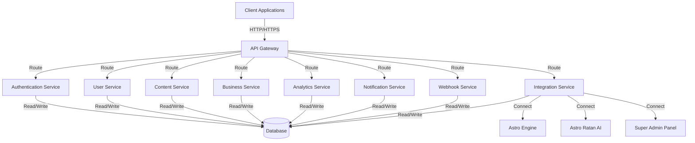
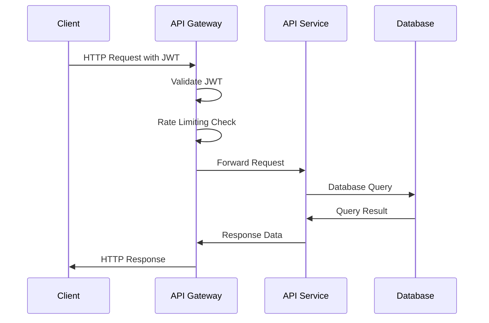

# API Reference Documentation

## Overview

The Corp Astro Backend Server provides a comprehensive set of RESTful APIs for integrating with the mobile application, Super Admin Panel (SAP), and other external systems. This document details all available endpoints, request/response formats, authentication requirements, and usage examples.

## Authentication

All API endpoints (except public endpoints) require authentication using JSON Web Tokens (JWT). Include the token in the `Authorization` header of your requests:

```
Authorization: Bearer YOUR_JWT_TOKEN
```

For detailed information about the authentication system, see the [Authentication Guide](/docs/authentication-guide.md).

## API Versioning

The API is versioned to ensure backward compatibility. The current version is `v1`. Include the version in the URL path:

```
https://api.corpastro.com/api/v1/resource
```

## Base URL

- **Production**: `https://api.corpastro.com/api/v1`
- **Staging**: `https://staging-api.corpastro.com/api/v1`
- **Development**: `http://localhost:3000/api/v1`

## Response Format

All API responses follow a consistent format:

```json
{
  "success": true,
  "data": {
    // Response data
  },
  "meta": {
    // Metadata (pagination, etc.)
  }
}
```

For error responses:

```json
{
  "success": false,
  "error": {
    "code": "ERROR_CODE",
    "message": "Human-readable error message",
    "details": {
      // Additional error details
    }
  }
}
```

## Rate Limiting

API requests are rate-limited to prevent abuse. The current limits are:

- **Authentication endpoints**: 10 requests per minute
- **Standard endpoints**: 60 requests per minute
- **Webhook endpoints**: 120 requests per minute

Rate limit information is included in the response headers:

```
X-RateLimit-Limit: 60
X-RateLimit-Remaining: 59
X-RateLimit-Reset: 1589547834
```

## API Endpoints

The API is organized into the following categories:

- [Authentication API](#authentication-api)
- [User API](#user-api)
- [Content API](#content-api)
- [Business API](#business-api)
- [Analytics API](#analytics-api)
- [Notification API](#notification-api)
- [Webhook API](#webhook-api)
- [Integration API](#integration-api)

For detailed documentation of each category, please refer to the corresponding section.

## API Diagrams

### Overall API Architecture



### API Request Flow



## Authentication API

For detailed information, see [Authentication API Reference](/docs/api/authentication-api.md).

### Endpoints

| Method | Endpoint | Description | Authentication |
|--------|----------|-------------|----------------|
| POST | `/auth/register` | Register a new user | None |
| POST | `/auth/login` | Authenticate user and get JWT | None |
| POST | `/auth/refresh` | Refresh JWT token | JWT |
| POST | `/auth/forgot-password` | Request password reset | None |
| POST | `/auth/reset-password` | Reset password with token | None |
| GET | `/auth/me` | Get current user information | JWT |

### Example: User Login

**Request:**

```bash
curl -X POST https://api.corpastro.com/api/v1/auth/login \
  -H "Content-Type: application/json" \
  -d '{
    "email": "user@example.com",
    "password": "securePassword123"
  }'
```

**Response:**

```json
{
  "success": true,
  "data": {
    "token": "eyJhbGciOiJIUzI1NiIsInR5cCI6IkpXVCJ9...",
    "user": {
      "user_id": "usr_123456789",
      "email": "user@example.com",
      "first_name": "John",
      "last_name": "Doe",
      "subscription_tier": "premium",
      "created_at": "2025-01-15T10:30:45Z"
    }
  }
}
```

## User API

For detailed information, see [User API Reference](/docs/api/user-api.md).

### Endpoints

| Method | Endpoint | Description | Authentication |
|--------|----------|-------------|----------------|
| GET | `/users/profile` | Get user profile | JWT |
| PUT | `/users/profile` | Update user profile | JWT |
| GET | `/users/subscription` | Get subscription details | JWT |
| POST | `/users/subscription` | Change subscription | JWT |
| GET | `/users/devices` | List user devices | JWT |
| POST | `/users/devices` | Register new device | JWT |
| DELETE | `/users/devices/:id` | Remove device | JWT |

## Content API

For detailed information, see [Content API Reference](/docs/api/content-api.md).

### Endpoints

| Method | Endpoint | Description | Authentication |
|--------|----------|-------------|----------------|
| GET | `/content/horoscopes/daily` | Get daily horoscope | JWT |
| GET | `/content/horoscopes/monthly` | Get monthly horoscope | JWT |
| GET | `/content/reports` | List available reports | JWT |
| GET | `/content/reports/:id` | Get specific report | JWT |
| GET | `/content/tools` | List available tools | JWT |
| POST | `/content/tools/:id/analyze` | Use a specific tool | JWT |

## Business API

For detailed information, see [Business API Reference](/docs/api/business-api.md).

### Endpoints

| Method | Endpoint | Description | Authentication |
|--------|----------|-------------|----------------|
| GET | `/business/profile` | Get business profile | JWT |
| POST | `/business/profile` | Create business profile | JWT |
| PUT | `/business/profile` | Update business profile | JWT |
| GET | `/business/analysis` | Get business analysis | JWT |
| POST | `/business/analysis/request` | Request new analysis | JWT |
| GET | `/business/recommendations` | Get business recommendations | JWT |

## Analytics API

For detailed information, see [Analytics API Reference](/docs/api/analytics-api.md).

### Endpoints

| Method | Endpoint | Description | Authentication |
|--------|----------|-------------|----------------|
| POST | `/analytics/events` | Track analytics event | JWT |
| GET | `/analytics/dashboard` | Get analytics dashboard data | JWT (Admin) |
| GET | `/analytics/reports` | Get analytics reports | JWT (Admin) |
| GET | `/analytics/ab-tests` | List A/B tests | JWT (Admin) |
| POST | `/analytics/ab-tests` | Create A/B test | JWT (Admin) |
| GET | `/analytics/ab-tests/:id` | Get A/B test details | JWT (Admin) |

## Notification API

For detailed information, see [Notification API Reference](/docs/api/notification-api.md).

### Endpoints

| Method | Endpoint | Description | Authentication |
|--------|----------|-------------|----------------|
| POST | `/notifications/register-device` | Register device for push notifications | JWT |
| PUT | `/notifications/settings` | Update notification settings | JWT |
| GET | `/notifications/settings` | Get notification settings | JWT |
| GET | `/notifications/history` | Get notification history | JWT |
| POST | `/notifications/send` | Send notification (admin) | JWT (Admin) |
| POST | `/notifications/schedule` | Schedule notification (admin) | JWT (Admin) |

## Webhook API

For detailed information, see [Webhook API Reference](/docs/api/webhook-api.md).

### Endpoints

| Method | Endpoint | Description | Authentication |
|--------|----------|-------------|----------------|
| POST | `/webhooks` | Register webhook | JWT (Admin) |
| GET | `/webhooks` | List webhooks | JWT (Admin) |
| GET | `/webhooks/:id` | Get webhook details | JWT (Admin) |
| PUT | `/webhooks/:id` | Update webhook | JWT (Admin) |
| DELETE | `/webhooks/:id` | Delete webhook | JWT (Admin) |
| GET | `/webhooks/:id/deliveries` | List webhook deliveries | JWT (Admin) |
| POST | `/webhooks/:id/test` | Test webhook | JWT (Admin) |

## Integration API

For detailed information, see [Integration API Reference](/docs/api/integration-api.md).

### Endpoints

| Method | Endpoint | Description | Authentication |
|--------|----------|-------------|----------------|
| POST | `/integrations/astro-engine/charts` | Generate astrological chart | JWT |
| GET | `/integrations/astro-engine/charts/:id` | Get chart details | JWT |
| POST | `/integrations/astro-ratan/chat` | Send message to Astro Ratan AI | JWT |
| GET | `/integrations/astro-ratan/conversations` | List AI conversations | JWT |
| GET | `/integrations/astro-ratan/conversations/:id` | Get conversation details | JWT |

## Error Codes

| Code | Description |
|------|-------------|
| `AUTH_INVALID_CREDENTIALS` | Invalid email or password |
| `AUTH_TOKEN_EXPIRED` | JWT token has expired |
| `AUTH_TOKEN_INVALID` | JWT token is invalid |
| `AUTH_INSUFFICIENT_PERMISSIONS` | User lacks required permissions |
| `RESOURCE_NOT_FOUND` | Requested resource not found |
| `RESOURCE_ALREADY_EXISTS` | Resource already exists |
| `VALIDATION_ERROR` | Request data validation failed |
| `RATE_LIMIT_EXCEEDED` | API rate limit exceeded |
| `SUBSCRIPTION_REQUIRED` | Premium subscription required |
| `INTERNAL_SERVER_ERROR` | Server encountered an error |

## SDK Libraries

We provide official SDK libraries for easy integration:

- [JavaScript/TypeScript SDK](https://github.com/corp-astro/corp-astro-js-sdk)
- [React Native SDK](https://github.com/corp-astro/corp-astro-react-native-sdk)
- [Swift SDK](https://github.com/corp-astro/corp-astro-swift-sdk)
- [Kotlin SDK](https://github.com/corp-astro/corp-astro-kotlin-sdk)

## Postman Collection

A Postman collection is available for testing the API:

[Download Postman Collection](https://api.corpastro.com/postman/corp-astro-api.json)

## API Changelog

| Version | Date | Changes |
|---------|------|---------|
| v1.0.0 | 2025-01-01 | Initial API release |
| v1.1.0 | 2025-02-15 | Added business analysis endpoints |
| v1.2.0 | 2025-03-30 | Added webhook system |
| v1.3.0 | 2025-05-10 | Added Astro Ratan AI integration |
