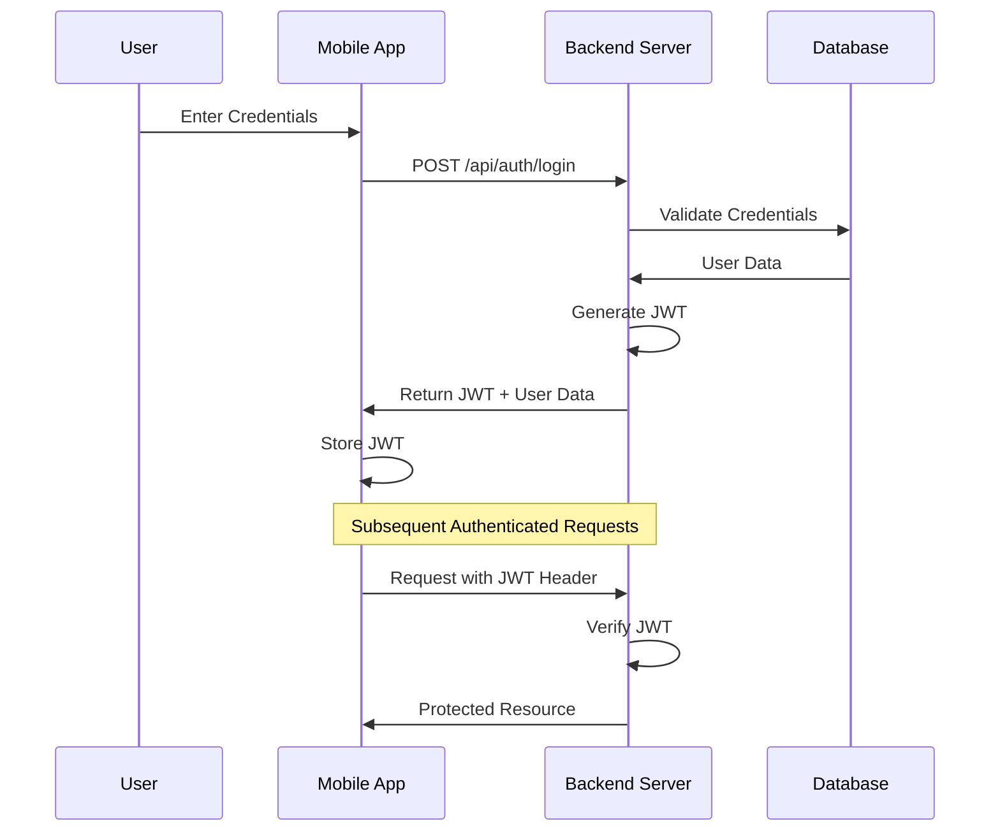

# Authentication System Documentation

## Overview

The Corp Astro Backend Server implements a comprehensive authentication system using JSON Web Tokens (JWT) for secure access to API endpoints. This document details the authentication flow, implementation, and integration points.

## Authentication Flow



## Implementation Components

### Authentication Controller

Located at `src/controllers/authController.ts`, this controller handles user registration, login, token refresh, and password reset.

```typescript
// Key functions in authController.ts
export const login = async (req: Request, res: Response) => {
  const { email, password } = req.body;
  
  // Validate user credentials
  const user = await User.findOne({ where: { email } });
  if (!user || !await bcrypt.compare(password, user.password_hash)) {
    return res.status(401).json({ error: 'Invalid credentials' });
  }
  
  // Generate JWT token
  const token = generateToken(user);
  
  // Return token and user data
  return res.json({
    token,
    user: {
      id: user.user_id,
      email: user.email,
      role: user.role,
      subscription_tier: user.subscription_tier
    }
  });
};
```

### Authentication Middleware

Located at `src/middleware/auth.ts`, this middleware verifies JWT tokens and attaches the user to the request object.

```typescript
// Key function in auth.ts
export const authenticateJWT = (req: Request, res: Response, next: NextFunction) => {
  const authHeader = req.headers.authorization;
  
  if (!authHeader) {
    return res.status(401).json({ error: 'Authorization header missing' });
  }
  
  const token = authHeader.split(' ')[1];
  
  try {
    const decoded = jwt.verify(token, process.env.JWT_SECRET as string) as JwtPayload;
    req.user = decoded;
    next();
  } catch (error) {
    return res.status(401).json({ error: 'Invalid token' });
  }
};
```

### Role-Based Authorization

Located at `src/middleware/roleCheck.ts`, this middleware checks if a user has the appropriate role for accessing certain routes.

```typescript
// Key function in roleCheck.ts
export const requireRole = (roles: string[]) => {
  return (req: Request, res: Response, next: NextFunction) => {
    if (!req.user) {
      return res.status(401).json({ error: 'Authentication required' });
    }
    
    if (!roles.includes(req.user.role)) {
      return res.status(403).json({ error: 'Insufficient permissions' });
    }
    
    next();
  };
};
```

## Authentication Routes

```
POST /api/auth/register - Register a new user
POST /api/auth/login - Authenticate and receive JWT
POST /api/auth/refresh - Refresh JWT token
POST /api/auth/forgot-password - Request password reset
POST /api/auth/reset-password - Reset password with token
GET /api/auth/me - Get current user information
```

## Security Considerations

1. **Token Expiration**: JWTs expire after a configurable time (default: 24 hours)
2. **HTTPS Only**: All authentication endpoints require HTTPS
3. **Password Hashing**: Passwords are hashed using bcrypt with a configurable salt rounds
4. **Rate Limiting**: Authentication endpoints are rate-limited to prevent brute force attacks
5. **Token Storage**: Mobile app stores tokens securely using platform-specific secure storage

## Mobile Integration

### JWT Storage on Mobile

```typescript
// Example: Storing JWT on mobile (React Native)
import * as SecureStore from 'expo-secure-store';

const storeToken = async (token: string) => {
  await SecureStore.setItemAsync('auth_token', token);
};

const getToken = async () => {
  return await SecureStore.getItemAsync('auth_token');
};
```

### Adding JWT to Requests

```typescript
// Example: Adding JWT to API requests (React Native)
import axios from 'axios';

const api = axios.create({
  baseURL: 'https://api.corpastro.com'
});

api.interceptors.request.use(async (config) => {
  const token = await getToken();
  if (token) {
    config.headers.Authorization = `Bearer ${token}`;
  }
  return config;
});
```

## Super Admin Panel (SAP) Integration

The authentication system integrates with the SAP through the same JWT mechanism:

1. Admin users log in through the SAP interface
2. The SAP sends credentials to the backend server
3. The backend verifies credentials and returns a JWT with admin role
4. The SAP stores the JWT and uses it for all API requests
5. The backend verifies the JWT and admin role for protected endpoints

## Testing Authentication

```bash
# Test user registration
curl -X POST https://api.corpastro.com/api/auth/register \
  -H "Content-Type: application/json" \
  -d '{"email":"test@example.com","password":"securePassword123","first_name":"Test","last_name":"User"}'

# Test user login
curl -X POST https://api.corpastro.com/api/auth/login \
  -H "Content-Type: application/json" \
  -d '{"email":"test@example.com","password":"securePassword123"}'

# Test protected endpoint
curl -X GET https://api.corpastro.com/api/auth/me \
  -H "Authorization: Bearer YOUR_JWT_TOKEN"
```
