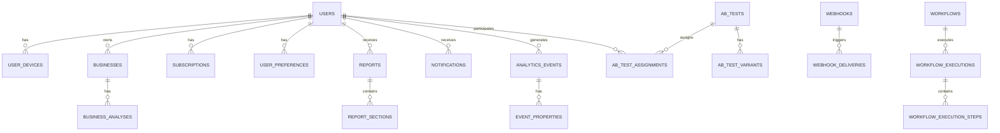

# Database Schema Documentation

## Overview

The Corp Astro Backend Server uses a relational database system (PostgreSQL) to store all application data. This document details the database schema, including tables, relationships, indexes, and migration processes.

## Database Architecture



## Table Definitions

### User Management

#### `users` Table

Stores user account information.

| Column | Type | Description | Constraints |
|--------|------|-------------|-------------|
| `user_id` | UUID | Unique identifier | Primary Key |
| `email` | VARCHAR(255) | User email address | Unique, Not Null |
| `password_hash` | VARCHAR(255) | Hashed password | Not Null |
| `first_name` | VARCHAR(100) | User's first name | Not Null |
| `last_name` | VARCHAR(100) | User's last name | Not Null |
| `phone_number` | VARCHAR(20) | User's phone number | |
| `date_of_birth` | DATE | User's date of birth | |
| `time_of_birth` | TIME | User's time of birth | |
| `place_of_birth` | VARCHAR(255) | User's place of birth | |
| `subscription_tier` | VARCHAR(20) | User's subscription level | Not Null, Default: 'free' |
| `role` | VARCHAR(20) | User's role in the system | Not Null, Default: 'user' |
| `status` | VARCHAR(20) | Account status | Not Null, Default: 'active' |
| `created_at` | TIMESTAMP | Account creation time | Not Null, Default: CURRENT_TIMESTAMP |
| `updated_at` | TIMESTAMP | Last update time | Not Null, Default: CURRENT_TIMESTAMP |
| `last_login_at` | TIMESTAMP | Last login time | |

**Indexes:**
- Primary Key: `user_id`
- Unique Index: `email`
- Index: `subscription_tier`
- Index: `status`

#### `user_devices` Table

Stores information about user devices for push notifications.

| Column | Type | Description | Constraints |
|--------|------|-------------|-------------|
| `device_id` | UUID | Unique identifier | Primary Key |
| `user_id` | UUID | Reference to users table | Foreign Key, Not Null |
| `device_token` | VARCHAR(255) | Push notification token | Not Null |
| `platform` | VARCHAR(20) | Device platform (ios, android) | Not Null |
| `device_model` | VARCHAR(100) | Device model | |
| `os_version` | VARCHAR(50) | Operating system version | |
| `app_version` | VARCHAR(50) | Application version | |
| `active` | BOOLEAN | Whether device is active | Not Null, Default: true |
| `created_at` | TIMESTAMP | Record creation time | Not Null, Default: CURRENT_TIMESTAMP |
| `updated_at` | TIMESTAMP | Last update time | Not Null, Default: CURRENT_TIMESTAMP |
| `last_used_at` | TIMESTAMP | Last time device was used | |

**Indexes:**
- Primary Key: `device_id`
- Foreign Key: `user_id` references `users(user_id)`
- Index: `device_token`
- Index: `platform`

#### `subscriptions` Table

Stores user subscription information.

| Column | Type | Description | Constraints |
|--------|------|-------------|-------------|
| `subscription_id` | UUID | Unique identifier | Primary Key |
| `user_id` | UUID | Reference to users table | Foreign Key, Not Null |
| `plan_id` | VARCHAR(50) | Subscription plan identifier | Not Null |
| `status` | VARCHAR(20) | Subscription status | Not Null |
| `start_date` | DATE | Subscription start date | Not Null |
| `end_date` | DATE | Subscription end date | |
| `auto_renew` | BOOLEAN | Whether subscription auto-renews | Not Null, Default: true |
| `payment_method` | VARCHAR(50) | Payment method used | |
| `payment_provider` | VARCHAR(50) | Payment provider | |
| `created_at` | TIMESTAMP | Record creation time | Not Null, Default: CURRENT_TIMESTAMP |
| `updated_at` | TIMESTAMP | Last update time | Not Null, Default: CURRENT_TIMESTAMP |

**Indexes:**
- Primary Key: `subscription_id`
- Foreign Key: `user_id` references `users(user_id)`
- Index: `plan_id`
- Index: `status`
- Index: `end_date`

#### `user_preferences` Table

Stores user preferences and settings.

| Column | Type | Description | Constraints |
|--------|------|-------------|-------------|
| `preference_id` | UUID | Unique identifier | Primary Key |
| `user_id` | UUID | Reference to users table | Foreign Key, Not Null |
| `notification_preferences` | JSONB | Notification settings | Not Null, Default: '{}' |
| `theme_preferences` | JSONB | UI theme settings | Not Null, Default: '{}' |
| `language` | VARCHAR(10) | Preferred language | Not Null, Default: 'en' |
| `timezone` | VARCHAR(50) | User's timezone | Not Null, Default: 'UTC' |
| `created_at` | TIMESTAMP | Record creation time | Not Null, Default: CURRENT_TIMESTAMP |
| `updated_at` | TIMESTAMP | Last update time | Not Null, Default: CURRENT_TIMESTAMP |

**Indexes:**
- Primary Key: `preference_id`
- Foreign Key: `user_id` references `users(user_id)`
- Index: `language`

### Business Management

#### `businesses` Table

Stores business information for corporate astrology.

| Column | Type | Description | Constraints |
|--------|------|-------------|-------------|
| `business_id` | UUID | Unique identifier | Primary Key |
| `user_id` | UUID | Reference to users table | Foreign Key, Not Null |
| `name` | VARCHAR(255) | Business name | Not Null |
| `registration_date` | DATE | Business registration date | |
| `registration_time` | TIME | Business registration time | |
| `registration_place` | VARCHAR(255) | Business registration place | |
| `industry` | VARCHAR(100) | Business industry | |
| `size` | VARCHAR(50) | Business size | |
| `logo_url` | VARCHAR(255) | URL to business logo | |
| `website` | VARCHAR(255) | Business website | |
| `description` | TEXT | Business description | |
| `created_at` | TIMESTAMP | Record creation time | Not Null, Default: CURRENT_TIMESTAMP |
| `updated_at` | TIMESTAMP | Last update time | Not Null, Default: CURRENT_TIMESTAMP |

**Indexes:**
- Primary Key: `business_id`
- Foreign Key: `user_id` references `users(user_id)`
- Index: `name`
- Index: `industry`

#### `business_analyses` Table

Stores astrological analyses for businesses.

| Column | Type | Description | Constraints |
|--------|------|-------------|-------------|
| `analysis_id` | UUID | Unique identifier | Primary Key |
| `business_id` | UUID | Reference to businesses table | Foreign Key, Not Null |
| `analysis_type` | VARCHAR(50) | Type of analysis | Not Null |
| `chart_data` | JSONB | Astrological chart data | |
| `summary` | TEXT | Analysis summary | |
| `detailed_analysis` | TEXT | Detailed analysis | |
| `recommendations` | TEXT | Business recommendations | |
| `created_at` | TIMESTAMP | Record creation time | Not Null, Default: CURRENT_TIMESTAMP |
| `updated_at` | TIMESTAMP | Last update time | Not Null, Default: CURRENT_TIMESTAMP |

**Indexes:**
- Primary Key: `analysis_id`
- Foreign Key: `business_id` references `businesses(business_id)`
- Index: `analysis_type`

### Content Management

#### `reports` Table

Stores generated reports for users.

| Column | Type | Description | Constraints |
|--------|------|-------------|-------------|
| `report_id` | UUID | Unique identifier | Primary Key |
| `user_id` | UUID | Reference to users table | Foreign Key, Not Null |
| `business_id` | UUID | Reference to businesses table | Foreign Key |
| `report_type` | VARCHAR(50) | Type of report | Not Null |
| `title` | VARCHAR(255) | Report title | Not Null |
| `summary` | TEXT | Report summary | |
| `generated_date` | DATE | Date report was generated | Not Null |
| `period_start` | DATE | Start of period covered | |
| `period_end` | DATE | End of period covered | |
| `status` | VARCHAR(20) | Report status | Not Null, Default: 'active' |
| `created_at` | TIMESTAMP | Record creation time | Not Null, Default: CURRENT_TIMESTAMP |
| `updated_at` | TIMESTAMP | Last update time | Not Null, Default: CURRENT_TIMESTAMP |

**Indexes:**
- Primary Key: `report_id`
- Foreign Key: `user_id` references `users(user_id)`
- Foreign Key: `business_id` references `businesses(business_id)`
- Index: `report_type`
- Index: `generated_date`
- Index: `status`

#### `report_sections` Table

Stores sections of reports.

| Column | Type | Description | Constraints |
|--------|------|-------------|-------------|
| `section_id` | UUID | Unique identifier | Primary Key |
| `report_id` | UUID | Reference to reports table | Foreign Key, Not Null |
| `title` | VARCHAR(255) | Section title | Not Null |
| `content` | TEXT | Section content | Not Null |
| `order` | INTEGER | Display order | Not Null |
| `created_at` | TIMESTAMP | Record creation time | Not Null, Default: CURRENT_TIMESTAMP |
| `updated_at` | TIMESTAMP | Last update time | Not Null, Default: CURRENT_TIMESTAMP |

**Indexes:**
- Primary Key: `section_id`
- Foreign Key: `report_id` references `reports(report_id)`
- Index: `order`

### Notification System

#### `notifications` Table

Stores notifications sent to users.

| Column | Type | Description | Constraints |
|--------|------|-------------|-------------|
| `notification_id` | UUID | Unique identifier | Primary Key |
| `user_id` | UUID | Reference to users table | Foreign Key, Not Null |
| `title` | VARCHAR(255) | Notification title | Not Null |
| `body` | TEXT | Notification body | Not Null |
| `data` | JSONB | Additional notification data | Not Null, Default: '{}' |
| `type` | VARCHAR(50) | Notification type | Not Null |
| `status` | VARCHAR(20) | Delivery status | Not Null, Default: 'pending' |
| `read` | BOOLEAN | Whether notification was read | Not Null, Default: false |
| `sent_at` | TIMESTAMP | Time notification was sent | |
| `read_at` | TIMESTAMP | Time notification was read | |
| `created_at` | TIMESTAMP | Record creation time | Not Null, Default: CURRENT_TIMESTAMP |
| `updated_at` | TIMESTAMP | Last update time | Not Null, Default: CURRENT_TIMESTAMP |

**Indexes:**
- Primary Key: `notification_id`
- Foreign Key: `user_id` references `users(user_id)`
- Index: `type`
- Index: `status`
- Index: `read`
- Index: `sent_at`

#### `scheduled_notifications` Table

Stores notifications scheduled for future delivery.

| Column | Type | Description | Constraints |
|--------|------|-------------|-------------|
| `schedule_id` | UUID | Unique identifier | Primary Key |
| `user_id` | UUID | Reference to users table | Foreign Key, Not Null |
| `title` | VARCHAR(255) | Notification title | Not Null |
| `body` | TEXT | Notification body | Not Null |
| `data` | JSONB | Additional notification data | Not Null, Default: '{}' |
| `scheduled_time` | TIMESTAMP | Scheduled delivery time | Not Null |
| `status` | VARCHAR(20) | Schedule status | Not Null, Default: 'pending' |
| `created_at` | TIMESTAMP | Record creation time | Not Null, Default: CURRENT_TIMESTAMP |
| `updated_at` | TIMESTAMP | Last update time | Not Null, Default: CURRENT_TIMESTAMP |

**Indexes:**
- Primary Key: `schedule_id`
- Foreign Key: `user_id` references `users(user_id)`
- Index: `scheduled_time`
- Index: `status`

### Analytics System

#### `analytics_events` Table

Stores analytics events from users.

| Column | Type | Description | Constraints |
|--------|------|-------------|-------------|
| `event_id` | UUID | Unique identifier | Primary Key |
| `user_id` | UUID | Reference to users table | Foreign Key |
| `event_name` | VARCHAR(100) | Name of the event | Not Null |
| `event_category` | VARCHAR(50) | Category of the event | Not Null |
| `device_id` | VARCHAR(255) | Device identifier | |
| `session_id` | VARCHAR(255) | Session identifier | |
| `ip_address` | VARCHAR(45) | IP address | |
| `user_agent` | VARCHAR(255) | User agent string | |
| `timestamp` | TIMESTAMP | Event timestamp | Not Null |
| `created_at` | TIMESTAMP | Record creation time | Not Null, Default: CURRENT_TIMESTAMP |

**Indexes:**
- Primary Key: `event_id`
- Foreign Key: `user_id` references `users(user_id)`
- Index: `event_name`
- Index: `event_category`
- Index: `timestamp`

#### `event_properties` Table

Stores properties for analytics events.

| Column | Type | Description | Constraints |
|--------|------|-------------|-------------|
| `property_id` | UUID | Unique identifier | Primary Key |
| `event_id` | UUID | Reference to analytics_events table | Foreign Key, Not Null |
| `property_name` | VARCHAR(100) | Property name | Not Null |
| `property_value` | TEXT | Property value | Not Null |
| `created_at` | TIMESTAMP | Record creation time | Not Null, Default: CURRENT_TIMESTAMP |

**Indexes:**
- Primary Key: `property_id`
- Foreign Key: `event_id` references `analytics_events(event_id)`
- Index: `property_name`

#### `ab_tests` Table

Stores A/B test configurations.

| Column | Type | Description | Constraints |
|--------|------|-------------|-------------|
| `test_id` | UUID | Unique identifier | Primary Key |
| `name` | VARCHAR(100) | Test name | Not Null |
| `description` | TEXT | Test description | |
| `start_date` | DATE | Test start date | Not Null |
| `end_date` | DATE | Test end date | |
| `status` | VARCHAR(20) | Test status | Not Null, Default: 'active' |
| `created_at` | TIMESTAMP | Record creation time | Not Null, Default: CURRENT_TIMESTAMP |
| `updated_at` | TIMESTAMP | Last update time | Not Null, Default: CURRENT_TIMESTAMP |

**Indexes:**
- Primary Key: `test_id`
- Unique Index: `name`
- Index: `status`
- Index: `start_date`
- Index: `end_date`

#### `ab_test_variants` Table

Stores variants for A/B tests.

| Column | Type | Description | Constraints |
|--------|------|-------------|-------------|
| `variant_id` | UUID | Unique identifier | Primary Key |
| `test_id` | UUID | Reference to ab_tests table | Foreign Key, Not Null |
| `name` | VARCHAR(100) | Variant name | Not Null |
| `description` | TEXT | Variant description | |
| `traffic_percentage` | DECIMAL(5,2) | Percentage of traffic | Not Null |
| `created_at` | TIMESTAMP | Record creation time | Not Null, Default: CURRENT_TIMESTAMP |
| `updated_at` | TIMESTAMP | Last update time | Not Null, Default: CURRENT_TIMESTAMP |

**Indexes:**
- Primary Key: `variant_id`
- Foreign Key: `test_id` references `ab_tests(test_id)`
- Index: `name`

#### `ab_test_assignments` Table

Stores user assignments to A/B test variants.

| Column | Type | Description | Constraints |
|--------|------|-------------|-------------|
| `assignment_id` | UUID | Unique identifier | Primary Key |
| `test_id` | UUID | Reference to ab_tests table | Foreign Key, Not Null |
| `variant_id` | UUID | Reference to ab_test_variants table | Foreign Key, Not Null |
| `user_id` | UUID | Reference to users table | Foreign Key, Not Null |
| `assigned_at` | TIMESTAMP | Assignment time | Not Null, Default: CURRENT_TIMESTAMP |
| `converted` | BOOLEAN | Whether user converted | Not Null, Default: false |
| `converted_at` | TIMESTAMP | Conversion time | |

**Indexes:**
- Primary Key: `assignment_id`
- Foreign Key: `test_id` references `ab_tests(test_id)`
- Foreign Key: `variant_id` references `ab_test_variants(variant_id)`
- Foreign Key: `user_id` references `users(user_id)`
- Unique Index: `(test_id, user_id)`
- Index: `converted`

### Integration System

#### `webhooks` Table

Stores webhook configurations.

| Column | Type | Description | Constraints |
|--------|------|-------------|-------------|
| `webhook_id` | UUID | Unique identifier | Primary Key |
| `client_id` | VARCHAR(255) | Client identifier | Not Null |
| `event_type` | VARCHAR(100) | Event type to trigger webhook | Not Null |
| `target_url` | VARCHAR(255) | Webhook target URL | Not Null |
| `secret` | VARCHAR(255) | Webhook secret for signing | Not Null |
| `description` | TEXT | Webhook description | |
| `status` | VARCHAR(20) | Webhook status | Not Null, Default: 'active' |
| `created_at` | TIMESTAMP | Record creation time | Not Null, Default: CURRENT_TIMESTAMP |
| `updated_at` | TIMESTAMP | Last update time | Not Null, Default: CURRENT_TIMESTAMP |

**Indexes:**
- Primary Key: `webhook_id`
- Index: `client_id`
- Index: `event_type`
- Index: `status`

#### `webhook_deliveries` Table

Stores webhook delivery attempts.

| Column | Type | Description | Constraints |
|--------|------|-------------|-------------|
| `delivery_id` | UUID | Unique identifier | Primary Key |
| `webhook_id` | UUID | Reference to webhooks table | Foreign Key, Not Null |
| `event_type` | VARCHAR(100) | Event type | Not Null |
| `payload` | TEXT | Webhook payload | Not Null |
| `status` | VARCHAR(20) | Delivery status | Not Null, Default: 'pending' |
| `response_code` | INTEGER | HTTP response code | |
| `response_body` | TEXT | Response body | |
| `error_message` | TEXT | Error message if failed | |
| `queued_at` | TIMESTAMP | Time added to queue | Not Null, Default: CURRENT_TIMESTAMP |
| `processing_started_at` | TIMESTAMP | Processing start time | |
| `delivered_at` | TIMESTAMP | Delivery time | |
| `failed_at` | TIMESTAMP | Failure time | |

**Indexes:**
- Primary Key: `delivery_id`
- Foreign Key: `webhook_id` references `webhooks(webhook_id)`
- Index: `event_type`
- Index: `status`
- Index: `queued_at`

### Workflow System

#### `workflows` Table

Stores workflow definitions.

| Column | Type | Description | Constraints |
|--------|------|-------------|-------------|
| `workflow_id` | UUID | Unique identifier | Primary Key |
| `name` | VARCHAR(255) | Workflow name | Not Null |
| `description` | TEXT | Workflow description | |
| `definition` | JSONB | Workflow definition | Not Null |
| `trigger_type` | VARCHAR(50) | Trigger type | Not Null |
| `trigger_config` | JSONB | Trigger configuration | Not Null, Default: '{}' |
| `status` | VARCHAR(20) | Workflow status | Not Null, Default: 'active' |
| `created_at` | TIMESTAMP | Record creation time | Not Null, Default: CURRENT_TIMESTAMP |
| `updated_at` | TIMESTAMP | Last update time | Not Null, Default: CURRENT_TIMESTAMP |

**Indexes:**
- Primary Key: `workflow_id`
- Index: `trigger_type`
- Index: `status`

#### `workflow_executions` Table

Stores workflow execution records.

| Column | Type | Description | Constraints |
|--------|------|-------------|-------------|
| `execution_id` | UUID | Unique identifier | Primary Key |
| `workflow_id` | UUID | Reference to workflows table | Foreign Key, Not Null |
| `trigger_data` | JSONB | Trigger data | Not Null, Default: '{}' |
| `variables` | JSONB | Execution variables | Not Null, Default: '{}' |
| `status` | VARCHAR(20) | Execution status | Not Null, Default: 'pending' |
| `result` | JSONB | Execution result | |
| `error_message` | TEXT | Error message if failed | |
| `started_at` | TIMESTAMP | Execution start time | Not Null, Default: CURRENT_TIMESTAMP |
| `completed_at` | TIMESTAMP | Execution completion time | |

**Indexes:**
- Primary Key: `execution_id`
- Foreign Key: `workflow_id` references `workflows(workflow_id)`
- Index: `status`
- Index: `started_at`
- Index: `completed_at`

#### `workflow_execution_steps` Table

Stores individual step executions within a workflow.

| Column | Type | Description | Constraints |
|--------|------|-------------|-------------|
| `step_id` | UUID | Unique identifier | Primary Key |
| `execution_id` | UUID | Reference to workflow_executions table | Foreign Key, Not Null |
| `step_name` | VARCHAR(255) | Step name | Not Null |
| `step_type` | VARCHAR(50) | Step type | Not Null |
| `input` | JSONB | Step input | Not Null, Default: '{}' |
| `output` | JSONB | Step output | |
| `status` | VARCHAR(20) | Step status | Not Null, Default: 'pending' |
| `error_message` | TEXT | Error message if failed | |
| `started_at` | TIMESTAMP | Step start time | Not Null, Default: CURRENT_TIMESTAMP |
| `completed_at` | TIMESTAMP | Step completion time | |

**Indexes:**
- Primary Key: `step_id`
- Foreign Key: `execution_id` references `workflow_executions(execution_id)`
- Index: `step_type`
- Index: `status`
- Index: `started_at`

## Database Relationships

### One-to-Many Relationships

1. **User to Devices**: A user can have multiple devices
   ```
   users.user_id → user_devices.user_id
   ```

2. **User to Businesses**: A user can have multiple businesses
   ```
   users.user_id → businesses.user_id
   ```

3. **User to Subscriptions**: A user can have multiple subscription records
   ```
   users.user_id → subscriptions.user_id
   ```

4. **User to Reports**: A user can receive multiple reports
   ```
   users.user_id → reports.user_id
   ```

5. **Business to Analyses**: A business can have multiple analyses
   ```
   businesses.business_id → business_analyses.business_id
   ```

6. **Report to Sections**: A report can have multiple sections
   ```
   reports.report_id → report_sections.report_id
   ```

7. **Webhook to Deliveries**: A webhook can have multiple delivery attempts
   ```
   webhooks.webhook_id → webhook_deliveries.webhook_id
   ```

8. **Workflow to Executions**: A workflow can have multiple executions
   ```
   workflows.workflow_id → workflow_executions.workflow_id
   ```

9. **Workflow Execution to Steps**: A workflow execution can have multiple steps
   ```
   workflow_executions.execution_id → workflow_execution_steps.execution_id
   ```

### Many-to-Many Relationships

1. **Users to A/B Tests**: Users can participate in multiple A/B tests, and A/B tests can have multiple users
   ```
   users.user_id → ab_test_assignments.user_id
   ab_tests.test_id → ab_test_assignments.test_id
   ```

## Database Migration Process

The Corp Astro Backend Server uses Sequelize migrations to manage database schema changes. Migrations are located in the `/src/database/migrations/` directory and follow a timestamp-based naming convention.

### Migration File Structure

```javascript
'use strict';

module.exports = {
  up: async (queryInterface, Sequelize) => {
    // Code to migrate up (create/modify tables)
  },
  
  down: async (queryInterface, Sequelize) => {
    // Code to migrate down (revert changes)
  }
};
```

### Running Migrations

```bash
# Run all pending migrations
npm run db:migrate

# Revert the most recent migration
npm run db:migrate:undo

# Revert all migrations
npm run db:migrate:undo:all

# Create a new migration file
npm run db:migrate:create -- --name=create-new-table
```

## Database Indexes

Indexes are created to optimize query performance for common access patterns:

1. **Primary Key Indexes**: Every table has a primary key index
2. **Foreign Key Indexes**: All foreign key columns are indexed
3. **Search Indexes**: Columns frequently used in WHERE clauses
4. **Sort Indexes**: Columns frequently used in ORDER BY clauses
5. **Unique Indexes**: Columns with uniqueness constraints

## Database Optimization

The database schema is optimized for:

1. **Query Performance**: Proper indexing and denormalization where necessary
2. **Data Integrity**: Foreign key constraints and validation
3. **Scalability**: Partitioning for large tables (analytics_events)
4. **Maintainability**: Consistent naming conventions and documentation

## Backup and Recovery

The database is backed up regularly:

1. **Full Backups**: Daily full database backups
2. **Incremental Backups**: Hourly incremental backups
3. **Point-in-Time Recovery**: WAL (Write-Ahead Log) archiving for point-in-time recovery
4. **Backup Verification**: Regular testing of backup restoration

## Data Retention Policies

1. **User Data**: Retained as long as the user account is active
2. **Analytics Data**: Aggregated after 12 months, raw data deleted after 24 months
3. **Logs and Audit Trails**: Retained for 6 months
4. **Reports**: Retained for the duration of the user's account
