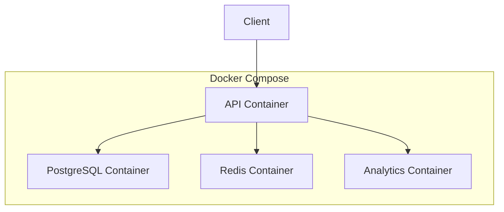

# Docker & CI/CD Guide

This document provides detailed information about Docker containerization and Continuous Integration/Continuous Deployment (CI/CD) for the Corp Astro Backend Server.

## Table of Contents

- [Docker Configuration](#docker-configuration)
- [Container Architecture](#container-architecture)
- [Development with Docker](#development-with-docker)
- [Production Deployment](#production-deployment)
- [CI/CD Pipeline](#cicd-pipeline)
- [Deployment Environments](#deployment-environments)
- [Rollback Procedures](#rollback-procedures)

## Docker Configuration

The Corp Astro Backend Server uses Docker for containerization, ensuring consistent environments across development, staging, and production.

### Docker Files

- `Dockerfile` - Main Docker image configuration
- `docker-compose.yml` - Multi-container setup for local development
- `docker-compose.prod.yml` - Production-ready container configuration
- `docker-compose.analytics.yml` - Analytics-specific container setup

### Dockerfile

The main Dockerfile uses a multi-stage build process to create an optimized production image:

```dockerfile
# Build stage
FROM node:18-alpine AS build

WORKDIR /app

COPY package*.json ./
RUN npm ci

COPY . .
RUN npm run build

# Production stage
FROM node:18-alpine

WORKDIR /app

COPY --from=build /app/dist ./dist
COPY --from=build /app/node_modules ./node_modules
COPY package*.json ./

ENV NODE_ENV=production
ENV PORT=3000

EXPOSE 3000

CMD ["node", "dist/app.js"]
```

### Docker Compose Configuration

The `docker-compose.yml` file configures the development environment:

```yaml
version: '3.8'

services:
  api:
    build: .
    ports:
      - "3000:3000"
    volumes:
      - .:/app
      - /app/node_modules
    environment:
      - NODE_ENV=development
      - DB_HOST=postgres
      - DB_PORT=5432
      - DB_NAME=corpastro
      - DB_USER=postgres
      - DB_PASSWORD=postgres
      - REDIS_HOST=redis
      - REDIS_PORT=6379
    depends_on:
      - postgres
      - redis

  postgres:
    image: postgres:14-alpine
    ports:
      - "5432:5432"
    volumes:
      - postgres_data:/var/lib/postgresql/data
    environment:
      - POSTGRES_USER=postgres
      - POSTGRES_PASSWORD=postgres
      - POSTGRES_DB=corpastro

  redis:
    image: redis:7-alpine
    ports:
      - "6379:6379"
    volumes:
      - redis_data:/data

volumes:
  postgres_data:
  redis_data:
```

## Container Architecture

The system uses the following Docker containers:



### Container Descriptions

1. **API Container**: Node.js application server running the Corp Astro Backend Server
   - Image: Custom Node.js image
   - Ports: 3000
   - Volumes: Application code, node_modules

2. **PostgreSQL Container**: Database server
   - Image: postgres:14-alpine
   - Ports: 5432
   - Volumes: PostgreSQL data

3. **Redis Container**: Cache and queue server
   - Image: redis:7-alpine
   - Ports: 6379
   - Volumes: Redis data

4. **Analytics Container**: Specialized container for analytics processing
   - Image: Custom Node.js image
   - Ports: 3001
   - Volumes: Analytics code, node_modules

## Development with Docker

### Starting the Development Environment

```bash
# Start all services
docker-compose up -d

# View logs
docker-compose logs -f

# Stop all services
docker-compose down
```

### Running Commands in Containers

```bash
# Run database migrations
docker-compose exec api npm run db:migrate

# Run tests
docker-compose exec api npm test

# Access PostgreSQL
docker-compose exec postgres psql -U postgres -d corpastro
```

### Rebuilding Containers

```bash
# Rebuild a specific service
docker-compose build api

# Rebuild and restart a service
docker-compose up -d --build api
```

## Production Deployment

### Building Production Images

```bash
# Build production images
docker-compose -f docker-compose.prod.yml build

# Push images to registry
docker-compose -f docker-compose.prod.yml push
```

### Deploying to Production

```bash
# Deploy to production
docker-compose -f docker-compose.prod.yml up -d

# Scale API servers
docker-compose -f docker-compose.prod.yml up -d --scale api=3
```

### Production Configuration

The `docker-compose.prod.yml` file includes production-specific configurations:

```yaml
version: '3.8'

services:
  api:
    image: corpastro/backend:latest
    restart: always
    ports:
      - "3000:3000"
    environment:
      - NODE_ENV=production
      - DB_HOST=${DB_HOST}
      - DB_PORT=${DB_PORT}
      - DB_NAME=${DB_NAME}
      - DB_USER=${DB_USER}
      - DB_PASSWORD=${DB_PASSWORD}
      - REDIS_HOST=${REDIS_HOST}
      - REDIS_PORT=${REDIS_PORT}
      - JWT_SECRET=${JWT_SECRET}
    deploy:
      replicas: 3
      update_config:
        parallelism: 1
        delay: 10s
      restart_policy:
        condition: on-failure
        max_attempts: 3
        window: 120s
    healthcheck:
      test: ["CMD", "curl", "-f", "http://localhost:3000/api/health"]
      interval: 30s
      timeout: 10s
      retries: 3
      start_period: 40s
```

## CI/CD Pipeline

The project includes GitHub Actions workflows for continuous integration and deployment:

### CI Workflow

The `.github/workflows/ci.yml` file defines the CI workflow:

```yaml
name: CI

on:
  push:
    branches: [ develop, feature/*, bugfix/* ]
  pull_request:
    branches: [ main, develop ]

jobs:
  test:
    runs-on: ubuntu-latest
    
    services:
      postgres:
        image: postgres:14
        env:
          POSTGRES_USER: postgres
          POSTGRES_PASSWORD: postgres
          POSTGRES_DB: corpastro_test
        ports:
          - 5432:5432
        options: >-
          --health-cmd pg_isready
          --health-interval 10s
          --health-timeout 5s
          --health-retries 5
      
      redis:
        image: redis:7
        ports:
          - 6379:6379
        options: >-
          --health-cmd "redis-cli ping"
          --health-interval 10s
          --health-timeout 5s
          --health-retries 5
    
    steps:
      - uses: actions/checkout@v3
      
      - name: Set up Node.js
        uses: actions/setup-node@v3
        with:
          node-version: '18'
          cache: 'npm'
      
      - name: Install dependencies
        run: npm ci
      
      - name: Lint
        run: npm run lint
      
      - name: Type check
        run: npm run typecheck
      
      - name: Run tests
        run: npm test
        env:
          NODE_ENV: test
          DB_HOST: localhost
          DB_PORT: 5432
          DB_NAME: corpastro_test
          DB_USER: postgres
          DB_PASSWORD: postgres
          REDIS_HOST: localhost
          REDIS_PORT: 6379
          JWT_SECRET: test-secret
```

### CD Workflow

The `.github/workflows/cd.yml` file defines the CD workflow:

```yaml
name: CD

on:
  push:
    branches: [ main ]
    tags: [ 'v*' ]

jobs:
  build:
    runs-on: ubuntu-latest
    
    steps:
      - uses: actions/checkout@v3
      
      - name: Set up Docker Buildx
        uses: docker/setup-buildx-action@v2
      
      - name: Login to Docker Hub
        uses: docker/login-action@v2
        with:
          username: ${{ secrets.DOCKER_HUB_USERNAME }}
          password: ${{ secrets.DOCKER_HUB_TOKEN }}
      
      - name: Extract metadata
        id: meta
        uses: docker/metadata-action@v4
        with:
          images: corpastro/backend
          tags: |
            type=ref,event=branch
            type=ref,event=tag
            type=sha,format=short
      
      - name: Build and push
        uses: docker/build-push-action@v4
        with:
          context: .
          push: true
          tags: ${{ steps.meta.outputs.tags }}
          labels: ${{ steps.meta.outputs.labels }}
          cache-from: type=registry,ref=corpastro/backend:buildcache
          cache-to: type=registry,ref=corpastro/backend:buildcache,mode=max
  
  deploy-staging:
    needs: build
    if: github.ref == 'refs/heads/main'
    runs-on: ubuntu-latest
    
    steps:
      - uses: actions/checkout@v3
      
      - name: Deploy to staging
        uses: appleboy/ssh-action@master
        with:
          host: ${{ secrets.STAGING_HOST }}
          username: ${{ secrets.STAGING_USERNAME }}
          key: ${{ secrets.STAGING_SSH_KEY }}
          script: |
            cd /opt/corpastro
            docker-compose -f docker-compose.staging.yml pull
            docker-compose -f docker-compose.staging.yml up -d
  
  deploy-production:
    needs: deploy-staging
    if: startsWith(github.ref, 'refs/tags/v')
    runs-on: ubuntu-latest
    
    steps:
      - uses: actions/checkout@v3
      
      - name: Deploy to production
        uses: appleboy/ssh-action@master
        with:
          host: ${{ secrets.PRODUCTION_HOST }}
          username: ${{ secrets.PRODUCTION_USERNAME }}
          key: ${{ secrets.PRODUCTION_SSH_KEY }}
          script: |
            cd /opt/corpastro
            docker-compose -f docker-compose.prod.yml pull
            docker-compose -f docker-compose.prod.yml up -d
```

## Deployment Environments

The project supports multiple deployment environments:

### Development

- Local development environment
- Uses `docker-compose.yml`
- Runs with hot-reloading
- Uses local database and Redis

### Staging

- Pre-production environment
- Uses `docker-compose.staging.yml`
- Automatically deployed from the `main` branch
- Used for testing before production deployment

### Production

- Live environment
- Uses `docker-compose.prod.yml`
- Deployed from release tags (e.g., `v1.0.0`)
- Includes multiple replicas for high availability

## Rollback Procedures

In case of deployment issues, the following rollback procedures are available:

### Automatic Rollback

The CI/CD pipeline includes automatic health checks and will roll back to the previous version if health checks fail:

```yaml
deploy:
  replicas: 3
  update_config:
    parallelism: 1
    delay: 10s
    failure_action: rollback
    monitor: 60s
    max_failure_ratio: 0.3
    order: start-first
```

### Manual Rollback

To manually roll back to a previous version:

```bash
# Roll back to a specific version
docker-compose -f docker-compose.prod.yml up -d --scale api=3 corpastro/backend:v1.0.0

# Roll back to the previous deployment
docker-compose -f docker-compose.prod.yml rollback
```

### Database Rollback

To roll back database migrations:

```bash
# Roll back the most recent migration
docker-compose exec api npm run db:migrate:undo

# Roll back all migrations
docker-compose exec api npm run db:migrate:undo:all
```

For more detailed information on deployment and operations, see the [Operations Guide](/docs/operations-guide.md).
