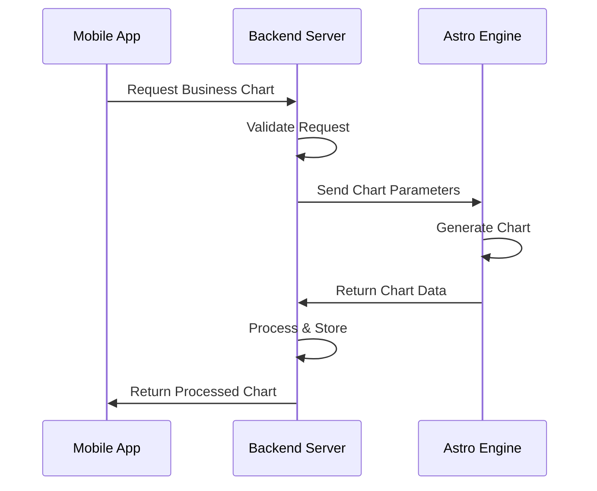
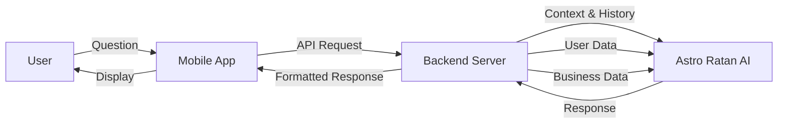
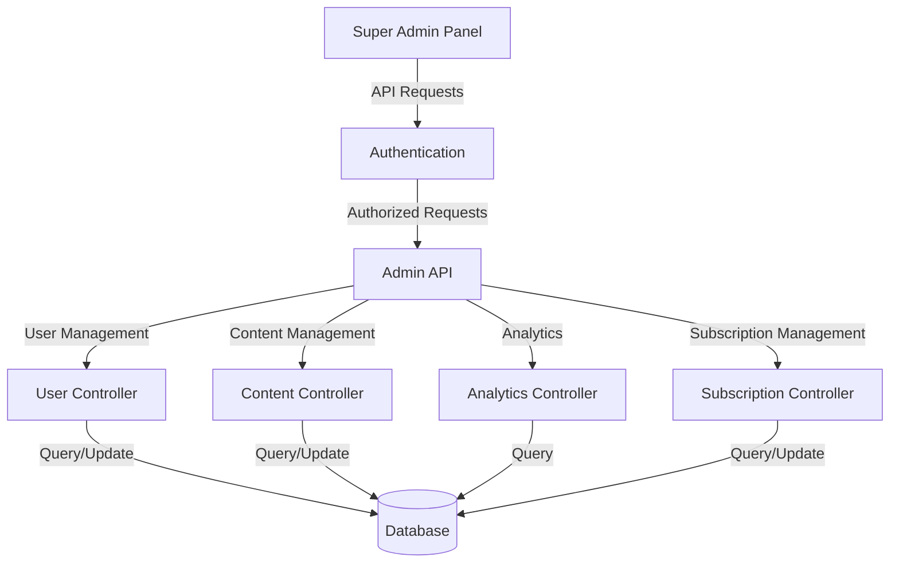

# Corp Astro Integration Guide

This document provides comprehensive information about integrating the Corp Astro Backend Server with other components of the Corp Astro ecosystem, including the Astro Engine, Astro Ratan AI, and Super Admin Panel (SAP).

## Table of Contents

- [Astro Engine Integration](#astro-engine-integration)
- [Astro Ratan AI Integration](#astro-ratan-ai-integration)
- [Super Admin Panel (SAP) Integration](#super-admin-panel-sap-integration)
- [Analytics Integration](#analytics-integration)
- [Mobile App Integration](#mobile-app-integration)

## Astro Engine Integration

The Astro Engine is responsible for all astrological calculations, including chart generation, transit analysis, and predictive algorithms.

### Integration Architecture



### Integration Components

- **Engine Client**: `src/services/astrology/engine-client.ts`
- **Chart Processor**: `src/services/astrology/chart-processor.ts`
- **Chart Controller**: `src/services/astrology/controllers/chartController.ts`

### Integration Process

1. The Backend Server receives a chart generation request from the Mobile App
2. The request is validated and processed
3. The Backend Server sends the chart parameters to the Astro Engine
4. The Astro Engine generates the chart data
5. The Backend Server processes and stores the chart data
6. The processed chart is returned to the Mobile App

### Code Example

```typescript
// Example: Generating a business natal chart
import { AstroEngineClient } from '../services/astrology/engine-client';

const engineClient = new AstroEngineClient();
const businessChart = await engineClient.generateBusinessChart({
  businessName: 'Acme Corp',
  foundingDate: '2020-01-15',
  foundingTime: '09:30:00',
  foundingLocation: 'New York, NY, USA',
  chartType: 'natal'
});
```

## Astro Ratan AI Integration

Astro Ratan is an AI agent built using OpenAI Assistant APIs, trained on astrology texts. It provides personalized astrological insights and guidance.

### Integration Architecture



### Integration Components

- **AI Client**: `src/services/ai/astro-ratan-client.ts`
- **Conversation Manager**: `src/services/ai/conversation-manager.ts`
- **AI Chat Controller**: `src/services/ai/controllers/aiChatController.ts`

### Integration Process

1. The user submits a question through the Mobile App
2. The Mobile App sends the question to the Backend Server
3. The Backend Server enriches the question with user and business context
4. The question and context are sent to the Astro Ratan AI
5. Astro Ratan AI generates a response
6. The Backend Server processes and formats the response
7. The response is sent back to the Mobile App for display

### Code Example

```typescript
// Example: Sending a user query to Astro Ratan
import { AstroRatanClient } from '../services/ai/astro-ratan-client';

const ratanClient = new AstroRatanClient();
const response = await ratanClient.sendQuery({
  userId: 'user-123',
  query: 'What business decisions should I avoid this week?',
  includeUserData: true,
  includeBusinessData: true
});
```

## Super Admin Panel (SAP) Integration

The Super Admin Panel is a web-based administration interface for managing content, users, subscriptions, and analytics.

### Integration Architecture



### Integration Components

- **Admin Controllers**: `src/controllers/adminDashboardController.ts`
- **Analytics Dashboard**: `src/controllers/analyticsDashboardController.ts`
- **Role Check Middleware**: `src/middleware/roleCheck.ts`

### API Endpoints for SAP

```
# User Management
GET /api/admin/users - List all users
GET /api/admin/users/:id - Get user details
PUT /api/admin/users/:id - Update user details
DELETE /api/admin/users/:id - Delete user

# Content Management
GET /api/admin/content - List all content
POST /api/admin/content - Create new content
PUT /api/admin/content/:id - Update content
DELETE /api/admin/content/:id - Delete content

# Subscription Management
GET /api/admin/subscriptions - List all subscriptions
GET /api/admin/subscriptions/metrics - Subscription metrics

# Analytics
GET /api/admin/analytics/overview - Overview metrics
GET /api/admin/analytics/users - User metrics
GET /api/admin/analytics/content - Content metrics
```

### Integration Process

1. The SAP authenticates with the Backend Server using JWT
2. The SAP makes API requests to the Backend Server
3. The Backend Server validates the requests and checks admin roles
4. The Backend Server processes the requests and returns the data
5. The SAP displays the data in the appropriate dashboard

## Analytics Integration

The Analytics System provides comprehensive tracking, analysis, and reporting capabilities. For detailed information, see the [Analytics System Documentation](/docs/analytics-system.md).

### Integration with SAP

The Analytics System integrates with the SAP through dedicated API endpoints:

```
GET /api/analytics/dashboard/overview - Overall metrics dashboard
GET /api/analytics/dashboard/users - User growth and engagement metrics
GET /api/analytics/dashboard/content - Content performance metrics
GET /api/analytics/dashboard/business - Business astrology feature usage
GET /api/analytics/dashboard/subscription - Subscription conversion and retention
GET /api/analytics/ab-tests - A/B test results and management
```

To integrate the Analytics System with the SAP:

1. Configure the SAP to use the JWT authentication from the backend server
2. Use the analytics API endpoints to fetch data for dashboards
3. Implement the dashboard components from `src/services/analytics/components/`
4. Set up real-time updates using WebSockets for live dashboards

### A/B Testing Integration

The A/B testing framework allows for testing different features and user experiences:

```typescript
// Example: Creating a new A/B test
const test = await ABTest.create({
  test_name: 'onboarding_flow_optimization',
  description: 'Testing different onboarding flows for conversion',
  variants: ['control', 'simplified', 'guided'],
  start_date: new Date(),
  status: 'active'
});

// Example: Assigning a user to a variant
const assignment = await assignUserToTest(userId, 'onboarding_flow_optimization');

// Example: Tracking conversion
const result = await trackConversion(userId, 'onboarding_flow_optimization', {
  completed: true,
  time_taken: 120, // seconds
  steps_completed: 4
});
```

## Mobile App Integration

The Backend Server provides dedicated APIs for the Mobile App, optimized for mobile-specific requirements.

### Mobile-Specific Optimizations

- **Batch Processing**: Reduces network overhead by processing multiple requests in a single call
- **Response Optimization**: Adapts responses based on device capabilities and network conditions
- **Offline Support**: Enables data synchronization for offline usage
- **Push Notifications**: Delivers personalized notifications to mobile devices

### Integration Components

- **Mobile Controllers**: `src/services/mobile/controllers/`
- **Mobile Middleware**: `src/services/mobile/middleware/`
- **Mobile Config**: `src/services/mobile/config/mobileConfig.ts`

### API Endpoints for Mobile

```
# Authentication
POST /api/mobile/auth/login - User login
POST /api/mobile/auth/register - User registration

# Content
GET /api/mobile/content/daily - Get daily horoscope
GET /api/mobile/content/monthly - Get monthly report
POST /api/mobile/content/favorite - Favorite content

# Business
POST /api/mobile/business/profile - Create business profile
GET /api/mobile/business/chart - Get business chart

# Free Tools
POST /api/mobile/tools/name-analysis - Analyze business name
POST /api/mobile/tools/tagline-analysis - Analyze business tagline

# Analytics
POST /api/mobile/analytics/event - Track analytics event
POST /api/mobile/analytics/batch - Batch process events
```

For more details on mobile integration, see the [Mobile API Documentation](/docs/mobile-api-integration-guide.md).
