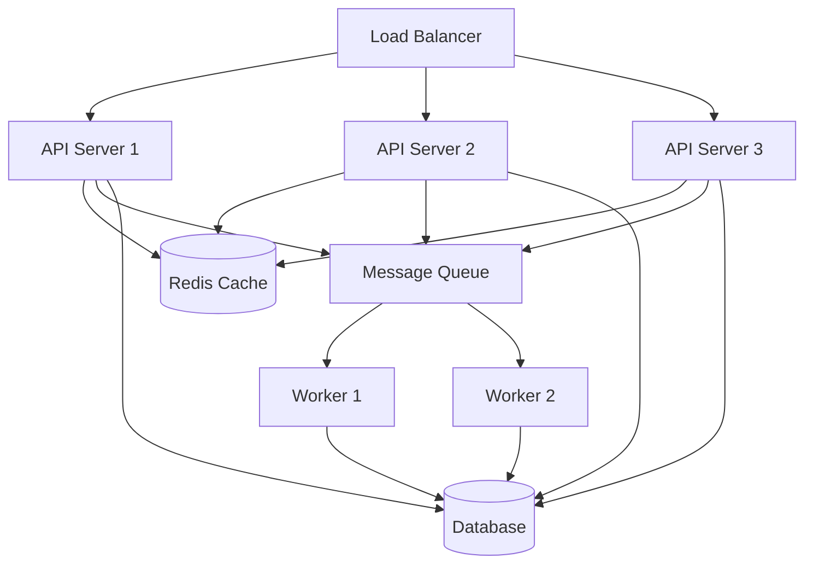

# Performance & Scalability Guide

This document provides detailed information about the performance optimization strategies and scalability architecture implemented in the Corp Astro Backend Server.

## Table of Contents

- [Performance Optimization Strategies](#performance-optimization-strategies)
- [Scalability Architecture](#scalability-architecture)
- [Horizontal Scaling](#horizontal-scaling)
- [Load Testing Results](#load-testing-results)
- [Monitoring & Alerting](#monitoring--alerting)
- [Performance Tuning Guidelines](#performance-tuning-guidelines)

## Performance Optimization Strategies

The Corp Astro Backend Server implements several strategies to ensure optimal performance:

### Response Caching

Redis-based caching is implemented for frequently accessed data to reduce database load and improve response times.

**Implementation Files:**
- `src/middleware/cache.ts` - Middleware for HTTP response caching
- `src/utils/cacheManager.ts` - Utility for managing cache entries

**Configuration:**
```typescript
// Example: Configuring cache middleware
import { cacheMiddleware } from '../middleware/cache';

// Cache for 5 minutes (300 seconds)
router.get('/api/content/daily', cacheMiddleware(300), contentController.getDailyHoroscope);

// Cache with custom key generator
router.get('/api/content/:id', cacheMiddleware(600, req => `content_${req.params.id}`), contentController.getContentById);
```

### Database Optimization

Database queries are optimized for performance through indexing, connection pooling, and query optimization.

**Implementation Files:**
- `src/config/sequelize.config.ts` - Database connection configuration
- `src/services/*/models/*.ts` - Model definitions with optimized queries

**Optimization Techniques:**
1. **Indexing**: All frequently queried fields are indexed
2. **Connection Pooling**: Reuse database connections to reduce overhead
3. **Query Optimization**: Use of efficient query patterns and avoiding N+1 queries
4. **Pagination**: Implement pagination for large result sets

```typescript
// Example: Optimized query with pagination
const users = await User.findAll({
  where: { subscription_tier: 'premium' },
  include: [
    {
      model: BusinessProfile,
      required: false
    }
  ],
  limit: 20,
  offset: (page - 1) * 20,
  order: [['created_at', 'DESC']]
});
```

### Response Compression

GZIP compression is implemented for API responses to reduce bandwidth usage and improve response times, especially for mobile clients.

**Implementation Files:**
- `src/middleware/compression.ts` - Compression middleware

**Configuration:**
```typescript
// Example: Configuring compression middleware
import compression from 'compression';

// Apply compression to all responses
app.use(compression());

// Apply compression with custom settings
app.use(compression({
  level: 6, // compression level (0-9)
  threshold: 1024, // only compress responses larger than 1KB
  filter: (req, res) => {
    // Don't compress responses for old browsers
    if (req.headers['user-agent'] && /MSIE [1-6]\./.test(req.headers['user-agent'])) {
      return false;
    }
    return compression.filter(req, res);
  }
}));
```

### Asynchronous Processing

Background job processing is implemented for non-critical tasks to improve response times for user-facing operations.

**Implementation Files:**
- `src/services/queue/queueManager.ts` - Queue management
- `src/services/queue/workers/*.ts` - Worker implementations

**Example Usage:**
```typescript
// Example: Adding a job to the queue
import { queueManager } from '../services/queue/queueManager';

// Add job to generate monthly report
await queueManager.add('generateMonthlyReport', {
  userId: 'user-123',
  month: 5,
  year: 2025
});

// Add job with priority and delay
await queueManager.add('sendNotification', {
  userId: 'user-123',
  title: 'New Content Available',
  message: 'Check out your new monthly report!'
}, {
  priority: 'high',
  delay: 60000 // 1 minute delay
});
```

## Scalability Architecture

The Corp Astro Backend Server is designed for horizontal scalability to handle increasing load:



### Key Components

1. **Load Balancer**: Distributes incoming requests across multiple API servers
2. **API Servers**: Stateless application servers that handle HTTP requests
3. **Redis Cache**: Centralized caching layer shared across all API servers
4. **Message Queue**: Distributes background tasks to worker processes
5. **Worker Processes**: Handle asynchronous tasks and background processing
6. **Database**: Centralized data storage with connection pooling

## Horizontal Scaling

The server supports horizontal scaling through the following mechanisms:

### Stateless API Servers

All API servers are stateless, allowing for easy scaling by adding more instances:

- No session state stored in memory
- Authentication via JWT tokens
- Shared configuration via environment variables

**Implementation Files:**
- `src/app.ts` - Main application setup
- `src/server.ts` - HTTP server configuration

### Centralized Caching

Redis is used for shared caching across instances:

- Session data
- API response caching
- Distributed locks

**Implementation Files:**
- `src/config/redis.config.ts` - Redis connection configuration
- `src/utils/redisHelper.ts` - Redis utility functions

### Message Queue

Bull queue with Redis backend for distributed task processing:

- Background job processing
- Work distribution across multiple workers
- Job prioritization and scheduling

**Implementation Files:**
- `src/services/queue/queueManager.ts` - Queue management
- `src/services/queue/workers/*.ts` - Worker implementations

### Connection Pooling

Database connection pooling for efficient resource usage:

- Reuse database connections
- Configurable pool size based on load
- Connection timeout and retry logic

**Implementation Files:**
- `src/services/scalability/utils/connectionPoolManager.ts` - Connection pool management
- `src/config/sequelize.config.ts` - Database connection configuration

## Load Testing Results

The system has been load tested with the following results:

| Metric | Value |
|--------|-------|
| Concurrent Users | 1,000 |
| Requests per Second | 500 |
| Average Response Time | 120ms |
| 99th Percentile Response Time | 350ms |
| Error Rate | <0.1% |

### Testing Methodology

1. **Test Environment**: AWS EC2 instances (t3.large)
2. **Test Duration**: 30 minutes
3. **Test Scenarios**:
   - Authentication flow
   - Content retrieval
   - Business profile operations
   - Analytics event tracking

### Scaling Recommendations

Based on load testing results, the following scaling recommendations are provided:

- **API Servers**: 1 server per 200 concurrent users
- **Worker Processes**: 1 worker per 50 jobs/second
- **Redis Cache**: 1GB memory per 10,000 active users
- **Database**: Scale vertically for read/write operations, add read replicas for read-heavy workloads

## Monitoring & Alerting

The system includes comprehensive monitoring and alerting capabilities:

### System Metrics

- CPU usage
- Memory usage
- Disk I/O
- Network traffic

### Application Metrics

- Request rate
- Response time
- Error rate
- Queue length

### Business Metrics

- User registrations
- Content views
- Subscription conversions
- Feature usage

### Alerting Configuration

Alerts are configured in the `.env` file:

```env
# Alerting Configuration
ALERT_EMAIL=admin@corpastro.com
ALERT_SLACK_WEBHOOK=https://hooks.slack.com/services/xxx/yyy/zzz
ALERT_CPU_THRESHOLD=80
ALERT_MEMORY_THRESHOLD=85
ALERT_ERROR_RATE_THRESHOLD=5
```

## Performance Tuning Guidelines

### Node.js Configuration

Optimize Node.js for production:

```env
# Node.js Configuration
NODE_ENV=production
NODE_OPTIONS=--max-old-space-size=4096
```

### Database Tuning

Optimize PostgreSQL for performance:

```
# PostgreSQL Configuration
max_connections = 100
shared_buffers = 1GB
effective_cache_size = 3GB
work_mem = 32MB
maintenance_work_mem = 256MB
```

### Redis Tuning

Optimize Redis for caching and queues:

```
# Redis Configuration
maxmemory 1gb
maxmemory-policy allkeys-lru
```

### API Rate Limiting

Implement rate limiting to prevent abuse:

```typescript
// Example: Configuring rate limiting middleware
import { rateLimitMiddleware } from '../middleware/rateLimit';

// Limit to 100 requests per minute
app.use('/api/', rateLimitMiddleware(100, 60));

// Custom limits for specific endpoints
app.use('/api/content', rateLimitMiddleware(200, 60));
app.use('/api/auth', rateLimitMiddleware(20, 60));
```

For more detailed information on performance optimization, see the [Performance Optimization Guide](/docs/performance-optimization-guide.md).
