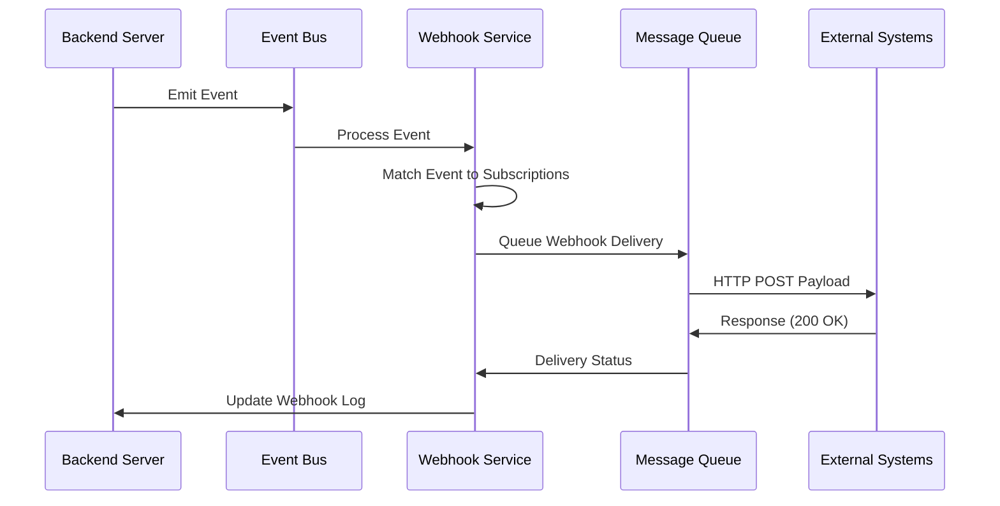

# Webhooks System Documentation

## Overview

The Corp Astro Backend Server implements a flexible webhooks system that allows real-time integration with external systems. This document details the webhooks architecture, implementation, and integration points.

## Webhooks Architecture



## Implementation Components

### Webhook Service

Located at `src/services/integrations/webhookService.ts`, this service handles the registration, management, and delivery of webhooks.

```typescript
// Key functions in webhookService.ts
export const registerWebhook = async (
  clientId: string,
  eventType: string,
  targetUrl: string,
  secret: string,
  description: string = ''
): Promise<Webhook> => {
  try {
    // Validate target URL
    if (!isValidUrl(targetUrl)) {
      throw new Error('Invalid target URL');
    }
    
    // Create webhook subscription
    const webhook = await Webhook.create({
      client_id: clientId,
      event_type: eventType,
      target_url: targetUrl,
      secret,
      description,
      status: 'active',
      created_at: new Date()
    });
    
    logger.info('Webhook registered', { webhookId: webhook.id, eventType, targetUrl });
    
    return webhook;
  } catch (error) {
    logger.error('Error registering webhook', { error, clientId, eventType });
    throw error;
  }
};

export const triggerWebhook = async (
  eventType: string,
  payload: Record<string, any>
): Promise<void> => {
  try {
    // Find all active webhooks for this event type
    const webhooks = await Webhook.findAll({
      where: {
        event_type: eventType,
        status: 'active'
      }
    });
    
    if (webhooks.length === 0) {
      logger.debug('No active webhooks found for event type', { eventType });
      return;
    }
    
    // Queue webhook deliveries
    await Promise.all(webhooks.map(webhook => 
      queueWebhookDelivery(webhook.id, eventType, payload)
    ));
    
    logger.info('Webhook deliveries queued', { 
      eventType, 
      count: webhooks.length 
    });
  } catch (error) {
    logger.error('Error triggering webhooks', { error, eventType });
    throw error;
  }
};
```

### Webhook Delivery Queue

Located at `src/services/integrations/webhookQueue.ts`, this module handles the queuing and processing of webhook deliveries.

```typescript
// Key function in webhookQueue.ts
export const queueWebhookDelivery = async (
  webhookId: string,
  eventType: string,
  payload: Record<string, any>
): Promise<string> => {
  try {
    // Create delivery record
    const delivery = await WebhookDelivery.create({
      webhook_id: webhookId,
      event_type: eventType,
      payload: JSON.stringify(payload),
      status: 'queued',
      queued_at: new Date()
    });
    
    // Add to queue for processing
    await queue.add('processWebhookDelivery', {
      deliveryId: delivery.id
    }, {
      attempts: 5,
      backoff: {
        type: 'exponential',
        delay: 30000 // 30 seconds
      },
      removeOnComplete: true
    });
    
    return delivery.id;
  } catch (error) {
    logger.error('Error queuing webhook delivery', { error, webhookId, eventType });
    throw error;
  }
};

export const processWebhookDelivery = async (
  deliveryId: string
): Promise<boolean> => {
  try {
    // Get delivery record
    const delivery = await WebhookDelivery.findByPk(deliveryId, {
      include: [Webhook]
    });
    
    if (!delivery) {
      throw new Error(`Webhook delivery not found: ${deliveryId}`);
    }
    
    const webhook = delivery.webhook;
    
    // Update delivery status
    await delivery.update({
      status: 'processing',
      processing_started_at: new Date()
    });
    
    // Prepare payload
    const payload = JSON.parse(delivery.payload);
    const timestamp = new Date().toISOString();
    const deliveryPayload = {
      id: delivery.id,
      timestamp,
      event_type: delivery.event_type,
      data: payload
    };
    
    // Sign payload
    const signature = createSignature(
      JSON.stringify(deliveryPayload),
      webhook.secret
    );
    
    // Send HTTP request
    const response = await axios.post(webhook.target_url, deliveryPayload, {
      headers: {
        'Content-Type': 'application/json',
        'X-Corp-Astro-Webhook-ID': delivery.id,
        'X-Corp-Astro-Event': delivery.event_type,
        'X-Corp-Astro-Signature': signature,
        'X-Corp-Astro-Timestamp': timestamp
      },
      timeout: 10000 // 10 seconds
    });
    
    // Update delivery status
    await delivery.update({
      status: 'delivered',
      response_code: response.status,
      response_body: JSON.stringify(response.data),
      delivered_at: new Date()
    });
    
    logger.info('Webhook delivered successfully', { 
      deliveryId, 
      webhookId: webhook.id,
      eventType: delivery.event_type
    });
    
    return true;
  } catch (error) {
    logger.error('Error processing webhook delivery', { error, deliveryId });
    
    // Update delivery status
    const delivery = await WebhookDelivery.findByPk(deliveryId);
    if (delivery) {
      await delivery.update({
        status: 'failed',
        error_message: error.message,
        failed_at: new Date()
      });
    }
    
    throw error;
  }
};
```

### Webhook Security

Located at `src/services/integrations/webhookSecurity.ts`, this module handles the security aspects of webhooks.

```typescript
// Key functions in webhookSecurity.ts
export const createSignature = (
  payload: string,
  secret: string
): string => {
  return crypto
    .createHmac('sha256', secret)
    .update(payload)
    .digest('hex');
};

export const verifySignature = (
  payload: string,
  signature: string,
  secret: string
): boolean => {
  const expectedSignature = createSignature(payload, secret);
  return crypto.timingSafeEqual(
    Buffer.from(signature),
    Buffer.from(expectedSignature)
  );
};
```

## Supported Event Types

The system supports various webhook event types:

1. **User Events**
   - `user.created` - When a new user is created
   - `user.updated` - When user details are updated
   - `user.subscription_changed` - When user subscription tier changes

2. **Content Events**
   - `content.published` - When new content is published
   - `content.updated` - When content is updated
   - `report.generated` - When a new report is generated

3. **Business Events**
   - `business.created` - When a new business is registered
   - `business.updated` - When business details are updated
   - `business.analysis_completed` - When business analysis is completed

4. **Integration Events**
   - `astro_engine.chart_generated` - When a new chart is generated
   - `astro_ratan.interaction_completed` - When an AI interaction is completed

## Webhook Payload Structure

All webhook payloads follow a consistent structure:

```json
{
  "id": "whd_123456789",
  "timestamp": "2025-05-17T10:30:45Z",
  "event_type": "user.created",
  "data": {
    // Event-specific data
  }
}
```

### Example Payloads

#### User Created Event

```json
{
  "id": "whd_123456789",
  "timestamp": "2025-05-17T10:30:45Z",
  "event_type": "user.created",
  "data": {
    "user_id": "usr_987654321",
    "email": "user@example.com",
    "subscription_tier": "free",
    "created_at": "2025-05-17T10:30:40Z"
  }
}
```

#### Report Generated Event

```json
{
  "id": "whd_123456789",
  "timestamp": "2025-05-17T10:30:45Z",
  "event_type": "report.generated",
  "data": {
    "report_id": "rep_123456789",
    "user_id": "usr_987654321",
    "report_type": "monthly_business",
    "month": "2025-05",
    "url": "https://api.corpastro.com/reports/rep_123456789"
  }
}
```

## Webhook Management API

```
POST /api/webhooks - Register a new webhook
GET /api/webhooks - List all webhooks for a client
GET /api/webhooks/:id - Get webhook details
PUT /api/webhooks/:id - Update webhook
DELETE /api/webhooks/:id - Delete webhook
GET /api/webhooks/:id/deliveries - List webhook deliveries
POST /api/webhooks/:id/test - Send test webhook
```

## External System Integration

### Receiving Webhooks

```typescript
// Example: Express server to receive webhooks
const express = require('express');
const crypto = require('crypto');
const bodyParser = require('body-parser');

const app = express();
app.use(bodyParser.json());

// Verify webhook signature
const verifyWebhookSignature = (req, res, next) => {
  const payload = JSON.stringify(req.body);
  const signature = req.headers['x-corp-astro-signature'];
  const webhookSecret = process.env.WEBHOOK_SECRET;
  
  const expectedSignature = crypto
    .createHmac('sha256', webhookSecret)
    .update(payload)
    .digest('hex');
  
  if (signature !== expectedSignature) {
    return res.status(401).json({ error: 'Invalid signature' });
  }
  
  next();
};

// Webhook endpoint
app.post('/webhooks/corp-astro', verifyWebhookSignature, (req, res) => {
  const event = req.headers['x-corp-astro-event'];
  const data = req.body.data;
  
  console.log(`Received webhook: ${event}`, data);
  
  // Process webhook based on event type
  switch (event) {
    case 'user.created':
      // Handle user created event
      break;
    case 'report.generated':
      // Handle report generated event
      break;
    default:
      console.log(`Unhandled event type: ${event}`);
  }
  
  // Acknowledge receipt
  res.status(200).json({ received: true });
});

app.listen(3000, () => {
  console.log('Webhook server listening on port 3000');
});
```

## Testing Webhooks

```bash
# Register a new webhook
curl -X POST https://api.corpastro.com/api/webhooks \
  -H "Content-Type: application/json" \
  -H "Authorization: Bearer YOUR_JWT_TOKEN" \
  -d '{
    "event_type": "user.created",
    "target_url": "https://example.com/webhooks/corp-astro",
    "secret": "your_webhook_secret",
    "description": "Notify when new users are created"
  }'

# Test webhook delivery
curl -X POST https://api.corpastro.com/api/webhooks/wh_123456789/test \
  -H "Authorization: Bearer YOUR_JWT_TOKEN"
```

## Webhook Best Practices

1. **Idempotency**: Always design webhook consumers to be idempotent, as webhooks may be delivered multiple times
2. **Quick Response**: Webhook receivers should respond quickly (under 10 seconds) and process the webhook asynchronously
3. **Signature Verification**: Always verify webhook signatures to ensure authenticity
4. **Logging**: Log all webhook deliveries for debugging and auditing
5. **Retry Strategy**: Implement a retry strategy for failed webhook deliveries
