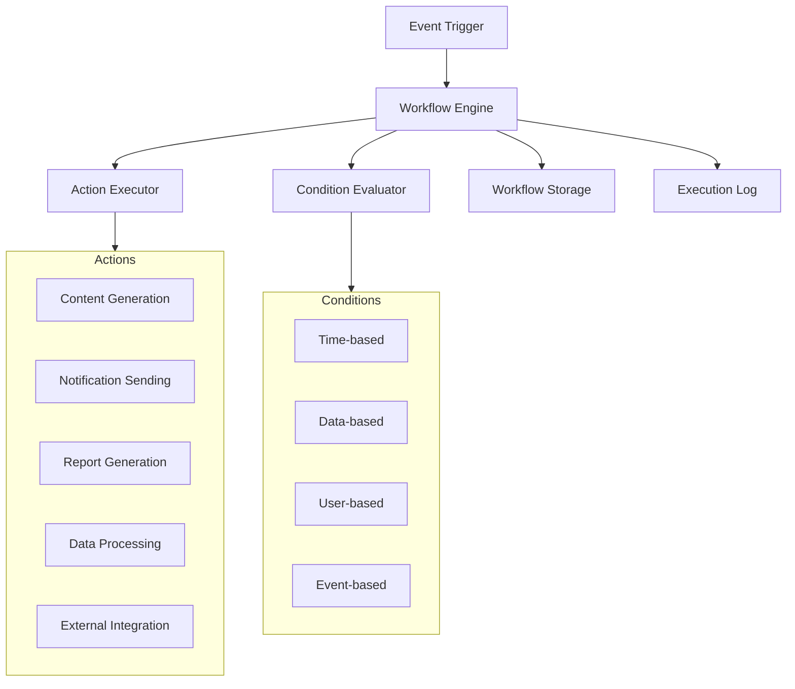
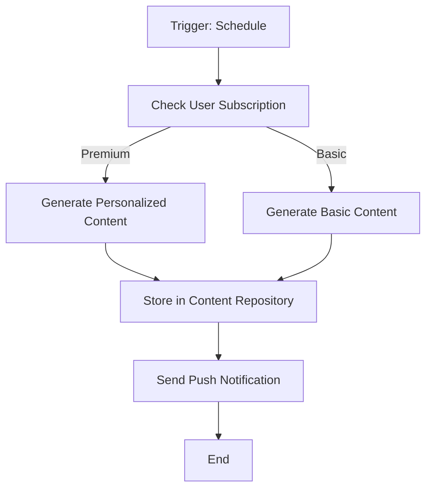
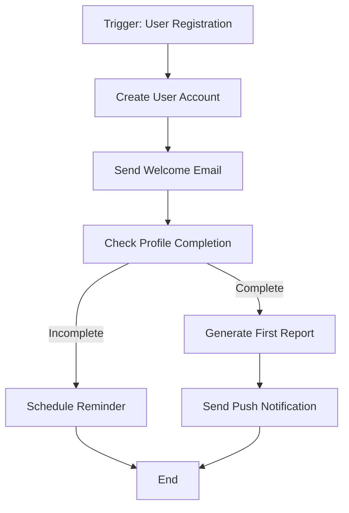
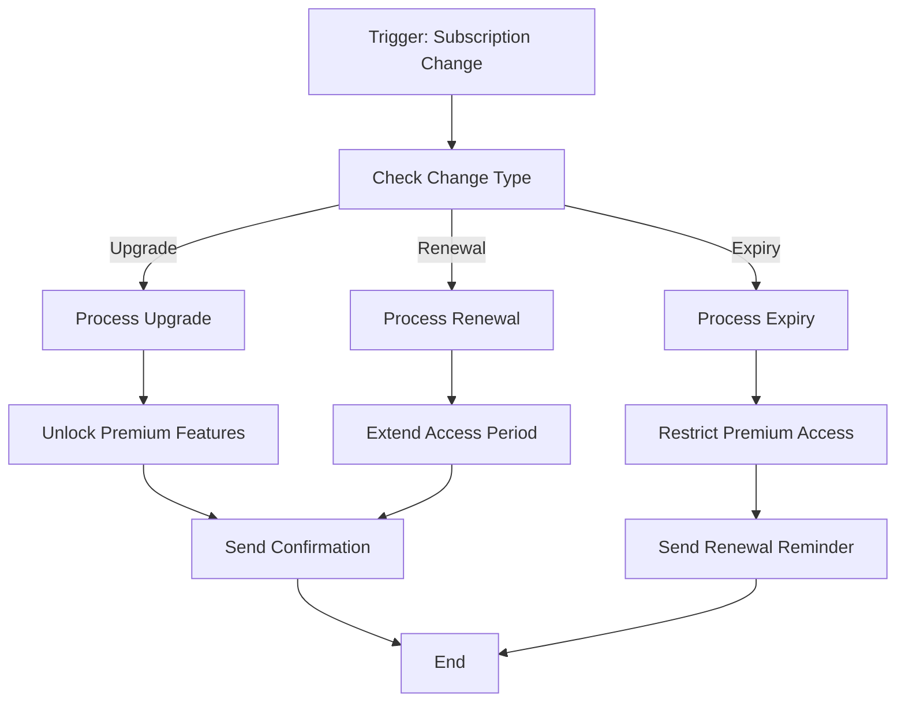
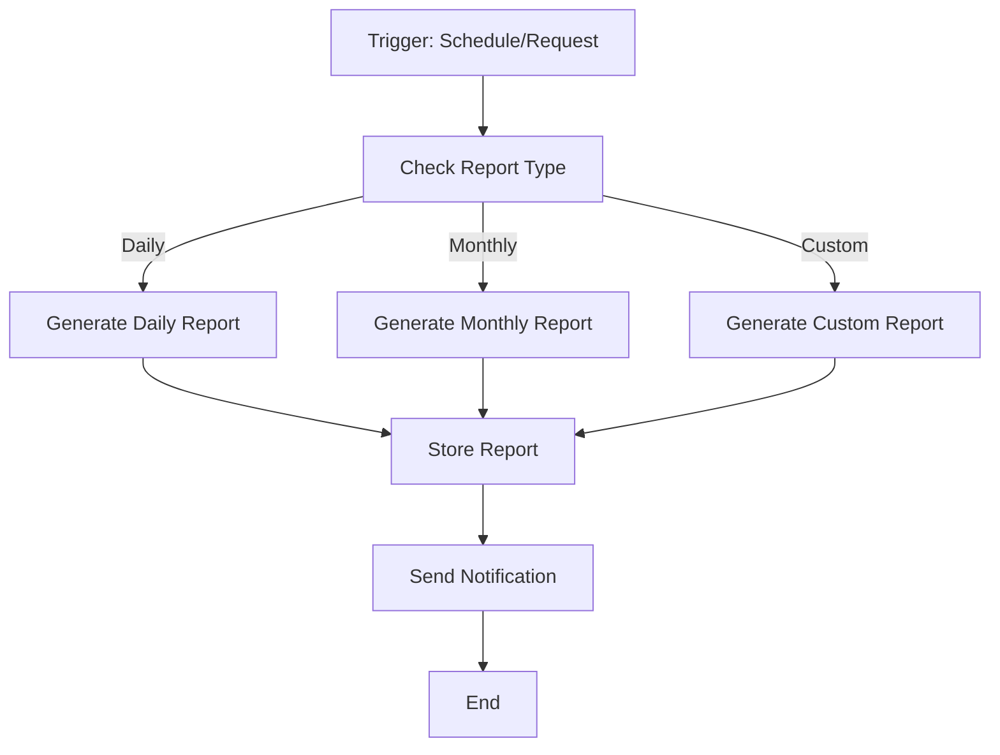

# Workflows System Documentation

## Overview

The Corp Astro Backend Server implements a powerful workflows system that automates complex business processes and integrates various components of the application. This document details the workflows architecture, implementation, and integration points.

## Workflows Architecture



## Implementation Components

### Workflow Engine

Located at `src/services/workflows/workflowEngine.ts`, this is the core component that processes workflow definitions and executes them.

```typescript
// Key functions in workflowEngine.ts
export const executeWorkflow = async (
  workflowId: string,
  triggerData: Record<string, any> = {}
): Promise<WorkflowExecutionResult> => {
  try {
    // Get workflow definition
    const workflow = await Workflow.findByPk(workflowId);
    
    if (!workflow) {
      throw new Error(`Workflow not found: ${workflowId}`);
    }
    
    if (workflow.status !== 'active') {
      logger.info(`Workflow ${workflowId} is not active, skipping execution`);
      return { success: false, reason: 'workflow_inactive' };
    }
    
    // Create execution record
    const execution = await WorkflowExecution.create({
      workflow_id: workflowId,
      trigger_data: JSON.stringify(triggerData),
      status: 'running',
      started_at: new Date()
    });
    
    // Parse workflow definition
    const definition = JSON.parse(workflow.definition);
    
    // Create execution context
    const context = {
      workflowId,
      executionId: execution.id,
      triggerData,
      variables: {},
      logger: createContextLogger(execution.id)
    };
    
    // Execute workflow steps
    const result = await executeWorkflowSteps(definition.steps, context);
    
    // Update execution record
    await execution.update({
      status: result.success ? 'completed' : 'failed',
      result: JSON.stringify(result),
      variables: JSON.stringify(context.variables),
      completed_at: new Date()
    });
    
    logger.info(`Workflow execution ${execution.id} completed`, { 
      workflowId, 
      success: result.success 
    });
    
    return result;
  } catch (error) {
    logger.error('Error executing workflow', { error, workflowId });
    
    // Update execution record if it exists
    const execution = await WorkflowExecution.findOne({
      where: {
        workflow_id: workflowId,
        status: 'running'
      },
      order: [['started_at', 'DESC']]
    });
    
    if (execution) {
      await execution.update({
        status: 'error',
        error_message: error.message,
        completed_at: new Date()
      });
    }
    
    return { 
      success: false, 
      reason: 'execution_error',
      error: error.message
    };
  }
};
```

### Workflow Steps Executor

Located at `src/services/workflows/stepExecutor.ts`, this module executes individual workflow steps.

```typescript
// Key function in stepExecutor.ts
export const executeWorkflowSteps = async (
  steps: WorkflowStep[],
  context: WorkflowContext
): Promise<WorkflowStepResult> => {
  let result: WorkflowStepResult = { success: true };
  
  for (const step of steps) {
    context.logger.debug(`Executing step: ${step.id}`, { step });
    
    // Check if step should be executed based on conditions
    if (step.conditions && step.conditions.length > 0) {
      const conditionsMet = await evaluateConditions(step.conditions, context);
      
      if (!conditionsMet) {
        context.logger.debug(`Skipping step ${step.id} as conditions not met`);
        continue;
      }
    }
    
    // Execute step based on type
    switch (step.type) {
      case 'action':
        result = await executeAction(step.action, step.params, context);
        break;
        
      case 'branch':
        result = await executeBranch(step.branches, context);
        break;
        
      case 'loop':
        result = await executeLoop(step.loopConfig, step.steps, context);
        break;
        
      case 'delay':
        result = await executeDelay(step.delayConfig, context);
        break;
        
      default:
        result = { 
          success: false, 
          reason: 'unknown_step_type',
          error: `Unknown step type: ${step.type}`
        };
    }
    
    // Log step execution
    await logStepExecution(context.executionId, step.id, result);
    
    // If step failed and it's not configured to continue on failure, stop execution
    if (!result.success && !step.continueOnFailure) {
      context.logger.info(`Workflow execution stopped at step ${step.id} due to failure`);
      return result;
    }
  }
  
  return result;
};
```

### Action Executor

Located at `src/services/workflows/actions/`, this directory contains modules for executing different types of actions.

```typescript
// Example action in notificationAction.ts
export const sendNotificationAction = async (
  params: SendNotificationParams,
  context: WorkflowContext
): Promise<WorkflowStepResult> => {
  try {
    const { userId, title, body, data } = params;
    
    // Resolve variables in parameters
    const resolvedUserId = resolveVariable(userId, context);
    const resolvedTitle = resolveVariable(title, context);
    const resolvedBody = resolveVariable(body, context);
    const resolvedData = resolveObjectVariables(data, context);
    
    // Send notification
    const result = await notificationService.sendPushNotification(
      resolvedUserId,
      resolvedTitle,
      resolvedBody,
      resolvedData
    );
    
    return {
      success: true,
      output: { notificationSent: result }
    };
  } catch (error) {
    context.logger.error('Error executing send notification action', { error, params });
    
    return {
      success: false,
      reason: 'action_error',
      error: error.message
    };
  }
};
```

### Condition Evaluator

Located at `src/services/workflows/conditions/`, this directory contains modules for evaluating different types of conditions.

```typescript
// Example condition in dataCondition.ts
export const evaluateDataCondition = async (
  condition: DataCondition,
  context: WorkflowContext
): Promise<boolean> => {
  try {
    const { field, operator, value } = condition;
    
    // Resolve variables
    const resolvedField = resolveVariable(field, context);
    const fieldValue = getNestedValue(context.triggerData, resolvedField);
    const resolvedValue = resolveVariable(value, context);
    
    // Evaluate condition based on operator
    switch (operator) {
      case 'equals':
        return fieldValue === resolvedValue;
        
      case 'notEquals':
        return fieldValue !== resolvedValue;
        
      case 'contains':
        return String(fieldValue).includes(String(resolvedValue));
        
      case 'greaterThan':
        return Number(fieldValue) > Number(resolvedValue);
        
      case 'lessThan':
        return Number(fieldValue) < Number(resolvedValue);
        
      case 'exists':
        return fieldValue !== undefined && fieldValue !== null;
        
      default:
        throw new Error(`Unknown operator: ${operator}`);
    }
  } catch (error) {
    context.logger.error('Error evaluating data condition', { error, condition });
    return false;
  }
};
```

## Workflow Types

The system supports various types of workflows:

### 1. Content Generation Workflows



### 2. User Onboarding Workflows



### 3. Subscription Management Workflows



### 4. Report Generation Workflows



## Workflow Definition Format

Workflows are defined in JSON format:

```json
{
  "id": "daily_horoscope_workflow",
  "name": "Daily Horoscope Generation",
  "description": "Generates and delivers daily horoscopes for users",
  "trigger": {
    "type": "schedule",
    "config": {
      "schedule": "0 0 * * *"
    }
  },
  "steps": [
    {
      "id": "get_users",
      "type": "action",
      "action": "database.query",
      "params": {
        "query": "SELECT user_id, subscription_tier FROM users WHERE status = 'active'"
      },
      "continueOnFailure": false
    },
    {
      "id": "process_users",
      "type": "loop",
      "loopConfig": {
        "collection": "{{steps.get_users.output.results}}",
        "variable": "user"
      },
      "steps": [
        {
          "id": "check_subscription",
          "type": "branch",
          "branches": [
            {
              "condition": {
                "type": "data",
                "field": "{{user.subscription_tier}}",
                "operator": "equals",
                "value": "premium"
              },
              "steps": [
                {
                  "id": "generate_premium_horoscope",
                  "type": "action",
                  "action": "content.generateHoroscope",
                  "params": {
                    "userId": "{{user.user_id}}",
                    "tier": "premium",
                    "date": "{{trigger.date}}"
                  }
                }
              ]
            },
            {
              "condition": {
                "type": "data",
                "field": "{{user.subscription_tier}}",
                "operator": "equals",
                "value": "basic"
              },
              "steps": [
                {
                  "id": "generate_basic_horoscope",
                  "type": "action",
                  "action": "content.generateHoroscope",
                  "params": {
                    "userId": "{{user.user_id}}",
                    "tier": "basic",
                    "date": "{{trigger.date}}"
                  }
                }
              ]
            }
          ]
        },
        {
          "id": "send_notification",
          "type": "action",
          "action": "notifications.send",
          "params": {
            "userId": "{{user.user_id}}",
            "title": "Your Daily Business Horoscope",
            "body": "Your personalized horoscope for today is ready!",
            "data": {
              "type": "daily_horoscope",
              "date": "{{trigger.date}}"
            }
          }
        }
      ]
    }
  ]
}
```

## Workflow Triggers

The system supports various workflow triggers:

1. **Schedule Triggers**: Time-based triggers using cron expressions
2. **Event Triggers**: Triggered by system events (user registration, content creation, etc.)
3. **API Triggers**: Manually triggered via API calls
4. **Data Triggers**: Triggered by data changes in the database

## Workflow Management API

```
POST /api/workflows - Create a new workflow
GET /api/workflows - List all workflows
GET /api/workflows/:id - Get workflow details
PUT /api/workflows/:id - Update workflow
DELETE /api/workflows/:id - Delete workflow
POST /api/workflows/:id/activate - Activate workflow
POST /api/workflows/:id/deactivate - Deactivate workflow
POST /api/workflows/:id/execute - Manually execute workflow
GET /api/workflows/:id/executions - List workflow executions
GET /api/workflows/executions/:id - Get execution details
```

## Workflow Designer UI

The Super Admin Panel (SAP) includes a visual workflow designer that allows administrators to create and manage workflows without writing code. The designer includes:

1. **Drag-and-drop Interface**: For adding and arranging workflow steps
2. **Condition Builder**: For creating complex conditions
3. **Variable Explorer**: For browsing and selecting available variables
4. **Testing Tools**: For testing workflows with sample data
5. **Version Control**: For tracking changes to workflow definitions

## Integration with Other Systems

### Analytics Integration

Workflows integrate with the analytics system to track:

1. **Execution Metrics**: Success rates, execution times, error rates
2. **User Engagement**: How users interact with workflow outputs
3. **Performance Optimization**: Identifying bottlenecks in workflows

### Astro Engine Integration

Workflows can trigger and process astrological calculations from the Astro Engine:

```typescript
// Example workflow step for chart generation
{
  "id": "generate_natal_chart",
  "type": "action",
  "action": "astroEngine.generateChart",
  "params": {
    "userId": "{{user.user_id}}",
    "chartType": "natal",
    "options": {
      "houseSystem": "whole_sign",
      "zodiacType": "sidereal",
      "ayanamsa": "lahiri"
    }
  }
}
```

### Astro Ratan AI Integration

Workflows can interact with the Astro Ratan AI for personalized content generation:

```typescript
// Example workflow step for AI content generation
{
  "id": "generate_ai_content",
  "type": "action",
  "action": "astroRatan.generateContent",
  "params": {
    "userId": "{{user.user_id}}",
    "contentType": "business_advice",
    "context": {
      "chart": "{{steps.generate_natal_chart.output.chart}}",
      "transits": "{{steps.generate_transits.output.transits}}",
      "business": "{{user.business_details}}"
    }
  }
}
```

## Testing Workflows

```bash
# Create a new workflow
curl -X POST https://api.corpastro.com/api/workflows \
  -H "Content-Type: application/json" \
  -H "Authorization: Bearer YOUR_JWT_TOKEN" \
  -d '{
    "name": "Test Workflow",
    "description": "A test workflow",
    "trigger": {
      "type": "api"
    },
    "steps": [
      {
        "id": "log_message",
        "type": "action",
        "action": "system.log",
        "params": {
          "message": "Hello, World!",
          "level": "info"
        }
      }
    ]
  }'

# Execute a workflow
curl -X POST https://api.corpastro.com/api/workflows/wf_123456789/execute \
  -H "Content-Type: application/json" \
  -H "Authorization: Bearer YOUR_JWT_TOKEN" \
  -d '{
    "triggerData": {
      "user_id": "usr_987654321"
    }
  }'
```

## Workflow Best Practices

1. **Idempotency**: Design workflows to be idempotent to prevent duplicate processing
2. **Error Handling**: Include appropriate error handling and fallback mechanisms
3. **Monitoring**: Set up monitoring and alerting for critical workflows
4. **Performance**: Optimize workflows for performance, especially those running at scale
5. **Testing**: Thoroughly test workflows with various input scenarios before deployment
